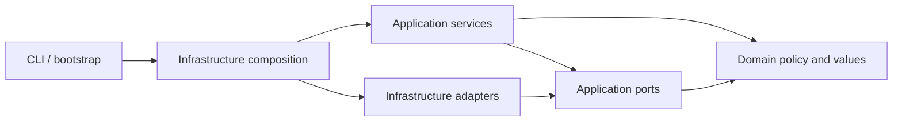

# ARCH-03.21 — Resulting architecture and runtime extension path

Issue: [#364](https://github.com/MatthiasBurger-Coder/Tiny-Swarm-World/issues/364).
Parent: [EPIC 03 / #313](https://github.com/MatthiasBurger-Coder/Tiny-Swarm-World/issues/313).
Baseline: implemented repository structure inspected on 2026-10-03. This guide
summarizes existing decisions; it introduces no new runtime or architecture decision.

## Package responsibilities and dependency direction

Tiny Swarm World is one Python automation process with hexagonal boundaries.
Platform, Artifacts, Deployment and Setup are in-process capability owners,
not independently deployed services. Python runs on Linux or WSL2.

| Package / surface | Responsibility and owner | Allowed dependencies |
|---|---|---|
| `domain/` | Domain policy: host classification, provider/configuration values, desired/current inventory, reconcile planning, deployment and verification facts | Domain and standard library; no application, infrastructure, YAML parser or host I/O |
| `application/ports/` | Application contract owner: runtime, provider, repositories, configuration, preflight, commands, progress and operation outcomes | Domain and port values; no services or concrete adapters |
| `application/services/platform/` | Platform lifecycle, preflight applicability, provider selection and runtime-profile policy | Domain, ports and application services |
| `application/services/artifacts/` | Artifact preparation, repository/build-input readiness and publication orchestration | Domain and ports; no deployment construction |
| `application/services/deployment/` | Stack intent, prepared configuration, secret consumption, apply and verification | Domain, ports and application services; no provider command transport |
| `application/services/setup/` | Ordered composed lifecycle phases and failure/progress aggregation | Application contracts; phases supplied by composition |
| `application/services/shared/` | Shared method tracing and safe operation-result aggregation | Application/domain contracts |
| `infrastructure/adapters/` | Technology owners: Incus/LXC, Docker/Swarm, HTTP, host/filesystem, YAML, evidence, credentials and terminal UI | Implements inward application ports; depends on application/domain |
| `infrastructure/process/` | Sole production child-process creation owner | Infrastructure process contracts and Python process APIs |
| `infrastructure/composition*.py` | Composition owner: concrete construction, capability selection and injection | Concrete adapters plus inward contracts |
| Package root / CLI / installers | Bootstrap and presentation; legacy installer edges are governed exceptions below | CLI delegates through composition; no new unrestricted root bypass |
| `infra/config/` and `infra/config/compose/` | Product command/provider/network/stack configuration and image contexts | Parsed by infrastructure; external syntax does not enter domain/application |

Dependency arrows point toward contracts, even when a workflow calls an adapter:



This is the intended dependency direction, with the exact legacy root imports
and composition cycles described below. There is no separate `interfaces`
package today. [Layer contracts](arch-03-02-layer-contracts.md),
[import-linter contracts](../../../.importlinter) and
[architecture regression rules](../../../tests/architecture/test_architecture_regressions.py)
define enforceable boundaries rather than a naming convention.

## Runtime boundary: Classic as the reference

“Classic” is the existing Docker Engine / Docker Swarm implementation on managed
LXC nodes. Keep three selection axes distinct:

* **Host:** native Linux or WSL2. Host detection and preparation do not select a
  container orchestrator. WSL-specific bridge/Socat handling is a host concern.
* **Node provider/backend:** `lxc_native`, normally Incus. The resolver also
  models the LXD backend; explicit preference and observed availability are
  separate inputs. No Multipass provider is supported.
* **Service profile:** `ServiceStackProfile` selects `default` or `service-access`
  stack contracts. There is no `CLASSIC` enum member in that type and no generic
  engine plugin selector. Podman/Kubernetes remain future scope.

[`RuntimeProfileResolver`](../../../src/tiny_swarm_world/application/services/platform/runtime_profile.py)
is deterministic capability policy over supplied facts. It returns `resolved`,
`unsupported` or `unavailable`; it performs no executable discovery itself.
Composition's `resolve_runtime_profile` gathers CLI availability and supplies the
request. An explicit supported backend can resolve without being observed as
available; resolution is not readiness or authorization. Concrete builders and
preflight still check executables/provider readiness and fail closed. Unsupported
intent must never silently fall back to Classic.

The proven stack contract is
[`PortSwarmStackRuntime`](../../../src/tiny_swarm_world/application/ports/clients/port_swarm_stack_runtime.py):
`deploy_stack`, `stack_exists`, `list_stack_services`, `external_secret_exists`
and `ensure_external_secret`. It returns typed `SwarmServiceStatus` observations,
not Docker command output. This contract is deliberately Swarm-specific.

Current wiring in
[`composition_deployment.py`](../../../src/tiny_swarm_world/infrastructure/composition_deployment.py)
creates `LxcSwarmRuntime`, wraps it in `DockerSwarmRuntime`, and injects that
application port into `EnsureSwarmStack`. The wrapper delegates proven operations;
the LXC adapter owns manager transport, stack assets and technical failures.
Container inspection and node lifecycle use separate `PortContainerRuntime` and
node-provider ports rather than growing the stack port into a universal engine.

The essential existing constructor pattern is:

```python
# Infrastructure composition: dependencies are already constructed here.
swarm_runtime = DockerSwarmRuntime(delegate=lxc_swarm_runtime)
step = EnsureSwarmStack(
    compose_repository=compose_repository,
    swarm_runtime=swarm_runtime,
    service_stack=service_stack,
)
```

This excerpt shows injection, not a runnable deployment command. For tests,
provide a mock implementing the same port; construction must never launch a
child process. `DockerSwarmRuntime.recover_infisical_migration_lock` is an existing
composition bootstrap hook outside the five-method port, not a requirement that
all runtime adapters implement implicitly.

## Composition root and orchestration flow

[`composition.py`](../../../src/tiny_swarm_world/infrastructure/composition.py)
is the stable public facade, including established patch seams. Capability
builders live in `composition_platform.py`, `composition_artifacts.py`,
`composition_deployment.py`, `composition_setup.py` and `composition_network.py`.
`composition_models.py` holds service bundles; `composition_lxc_runtimes.py`
holds provider-selected adapters; `composition_configuration.py` and
`composition_probes.py` own inputs and readiness helpers.
`composition_runtime.py` remains a private compatibility/helper module.
`ProjectPaths` supplies immutable repository/config/state paths to adapters.

The current workflow route is:

1. `__main__.py` parses operator intent, obtains required consent/confirmation,
   calls public composition and renders the result. `composition_cli.py` owns
   capability construction and delegates to application CLI actions.
2. Composition binds selected provider/host capabilities and supplies workflow
   steps. Native Linux/WSL2 preparation uses lazy factories keyed by host kind;
   the general preparation use case does not construct concrete adapters.
3. [`PlatformLifecycleOrchestrator`](../../../src/tiny_swarm_world/application/services/platform/lifecycle.py)
   dispatches a typed lifecycle request to exactly one supplied workflow.
   Reset/destroy receive confirmation explicitly. Setup retains its composed
   phase sequencing rather than routing every phase through the CLI.
4. Workflows enforce preflight, applicability and destructive-operation policy,
   then call ports. Platform init/reconcile own managed nodes; composed cluster
   phases own Docker installation, Swarm bootstrap and cluster verification.
   Setup also composes static artifact checks before mutation and readiness gates
   before dependent publication/deployment. Exact ordering is owned by
   `composition_setup.py` and `application/services/setup/workflow.py`.
5. Adapters perform technology-specific operations. Workflow verification
   observes readiness, persists allowed evidence through repositories and
   reports typed capability results. CLI/UI render those results.

[`OperationResult`](../../../src/tiny_swarm_world/application/ports/operation_result.py)
is additive to existing platform/artifact/deployment/setup result families.
Expected adapter failures carry safe operation/component/cause, recoverability
and recommended action. Shared aggregation retains confirmed, pending and
uncertain work plus originating failures. A timeout alone does not confirm a successful effect.
Command completion is narrower than service readiness; `rolled_back` requires
observed restoration through the
existing recovery workflow. Cancellation remains control flow. Rendering
recommended actions never executes them. See the
[operation-result analysis](arch-03-12-operation-results.md) and accepted ADR.

`EnsureSwarmStack.verify()` has a current compatibility shortcut: after its own
successful apply it returns `VERIFIED` with
`stack_registered=deploy_command_completed`, without re-observing replicas.
Otherwise it inspects stack existence and required service names. Neither result
alone proves replica convergence or endpoint health; separate composed readiness
checks own those observations. Do not interpret a deploy-command success as
complete runtime readiness.

## Planning versus execution

[`domain/inventory/reconciliation.py`](../../../src/tiny_swarm_world/domain/inventory/reconciliation.py)
defines immutable `DesiredState`, `CurrentState`, `ReconcilePlan` and
`ReconcileResult`. `ReconcilePlanner` compares supplied values without I/O and
returns explainable `NOOP`, `CREATE`, `UPDATE` or `REMOVE` actions in stable
resource-type/name/action ordering.

The planner is **additive**: current Classic platform reconciliation does not
consume its plans. Existing workflow steps still own execution and verification.
VM-named inventory categories are retained model vocabulary, not Multipass
support. A plan neither obtains consent nor authorizes removal. Connecting plans
to execution or adding new resource semantics requires a separately scoped,
reviewed change with observation, ownership, safety and recovery tests. See
[ARCH-03.07](arch-03-07-state-reconcile-planning.md).

## Configuration, secrets and process boundaries

* **Configuration:** infrastructure YAML repositories validate syntax and shape
  and convert to typed immutable domain/application values. Compose snapshots
  preserve rendered content and service metadata; deployment retains prepared
  configuration before mutation. Installer configuration staging/snapshots are
  infrastructure/legacy installer concerns, not an application YAML API.
  [`PortConfigurationSource`](../../../src/tiny_swarm_world/application/ports/configuration/port_configuration_source.py)
  exposes application input through a port. See
  [configuration parsing](arch-03-09-configuration-parsing-boundary.md) and the
  [operator configuration contract](../08_configuration/operator-configuration-contract.md).
* **Secrets:** deployment expresses discovery, consumption and external-secret
  intent through ports; infrastructure owns Infisical, protected local sources,
  Swarm transport and persistence. Credential snapshots and key allowlists
  associate verified consumption with prepared deployment. Secret names are
  metadata; values and raw process output must not enter logs, reprs, result
  dictionaries or evidence. Current internal-test defaults and optional
  protected overrides follow the
  [credential-source precedence](../08_configuration/credential-source-precedence.md)
  and [secret policy](../../security/secret-handling-policy.md); they are not
  production security guarantees.
* **Processes:** only `infrastructure/process/runner.py`, `async_runner.py` and
  `streaming.py` spawn production children. Adapters construct commands and map
  bounded outcomes; application services call ports. Async execution owns
  timeout/cancellation process-group cleanup. Raw streams may be private
  functional input for parsing or credential transport, never public diagnostics.
  The legacy Socat detached service has intentional lifecycle semantics. Tools
  outside production have separate ownership. See
  [process execution](arch-03-11-process-execution.md).

## Architecture fitness functions

Run checks from the repository root in Linux/WSL; manual test commands need
`PYTHONPATH=src`. [QUALITY.md](../../../QUALITY.md) is the command authority.

| Check | Enforced property / evidence |
|---|---|
| `python3 tools/quality_gate.py arch-lint` | `.importlinter`: domain isolation; application excludes infrastructure and CLI; ports exclude services |
| `python3 tools/quality_gate.py arch-tests` | Canonical hexagonal and architecture regression suites: root/CLI boundaries, exact legacy exceptions, parser and state boundaries, operation diagnostics, relative imports, prohibited-import mutation probes and no new composition cycle edges |
| `PYTHONPATH=src python3 -m unittest tests.architecture.test_process_spawn_boundaries` | Three-module production spawn allowlist and deliberate spawn regression probes |
| `PYTHONPATH=src python3 -m unittest tests.domain.inventory.test_reconciliation tests.application.services.platform.test_runtime_profile tests.application.services.platform.test_platform_lifecycle` | Deterministic plans/profile decisions and typed lifecycle dispatch |
| `PYTHONPATH=src python3 -m unittest tests.infrastructure.adapters.clients.test_docker_swarm_runtime tests.application.services.deployment.test_ensure_swarm_stack tests.infrastructure.test_composition` | Classic delegation, apply/stack registration and composition seams with mocks |
| `python3 tools/quality_gate.py complexity` | Reviewed complexity thresholds/baselines and explicit exceptions; no blanket size rule |
| `python3 tools/quality_gate.py quality` | Verification-policy, complexity, lint, arch-lint, arch-tests, typecheck and full unit suite |
| `git diff --check` | Documentation/change whitespace hygiene |

The canonical `arch-tests` command runs two named suites, not every architecture
module; the full unit gate discovers the remaining architecture checks. Local
checks do not establish installation, live, browser or SonarQube success. Record
applicability and actual results under the
[verification-state policy](../../process/verification-state-policy.md).

## Extension guide: add runtime support safely

The following is a contribution path, not implemented multi-runtime support.
Use Classic's adapter, composition and mocked contracts as the reference.

1. **Define the capability and decision scope.** Separate a different host,
   managed-node backend, Swarm transport or container orchestrator. A transport
   implementing the existing Swarm semantics can reuse `PortSwarmStackRuntime`.
   A Podman/Kubernetes engine cannot be made supported by registering a class:
   stack/service/replica/secret semantics differ and require an approved
   requirement/ADR before changing contracts. Keep Docker Swarm first.
2. **Audit the current contract.** Read `EnsureSwarmStack`, the five stack-port
   methods, typed statuses, operation failures and Classic tests. Identify
   readiness, secrets, artifact publication, update/recovery and host/provider
   assumptions. Do not pretend the bootstrap recovery hook belongs to the port.
3. **Implement infrastructure adapters.** Place concrete technology under
   `infrastructure/adapters/`; implement the proven port with typed observations
   and declared safe failures. Reuse process runners, structured parsers and
   path configuration. Keep executable discovery, HTTP, filesystem, command
   formatting and credential transport out of domain and neutral workflows.
4. **Wire through focused composition.** Follow `build_lxc_deployment_services`:
   construct the transport, inject the stack runtime and supply workflow steps.
   Add other required container/provider/artifact/observer adapters at their own
   capability builders. Preserve the public composition facade and avoid new
   cycle edges. There is no runtime registration API to call today.
5. **Extend selection only where justified.** Keep discovery in infrastructure
   and capability policy in the resolver/provider selection owner. New provider
   or engine intent may need approved typed-model/policy changes; it cannot be
   enabled through an arbitrary environment string. Builders/preflight must
   reject missing or unsupported capabilities before mutation, preserving
   explicit consent, exact destructive confirmation and unsupported-host rules.
6. **Reuse core orchestration.** Inject new ports into the existing lifecycle
   and deployment workflows rather than adding engine-name switches there.
   When existing contracts cannot express a capability, stop for a reviewed
   contract evolution instead of claiming a zero-change adapter extension.
   Host/preflight applicability branches remain deliberate policy.
7. **Verify parity without live effects.** Reuse Classic tests with mocked
   ports and add adapter contract tests for success, refusal/unavailability,
   timeout/cancellation, partial/uncertain effects, readiness, secret redaction
   and recovery where applicable. Run targeted checks and the full local gate.
   Do not weaken allowlists or assertions to admit a technology bypass.
8. **Document and obtain scoped live evidence.** Update building/runtime views,
   configuration contracts, ADR consequences and debt. Any live validation
   needs separate explicit consent and prerequisites; record unavailable or
   skipped external checks as non-success. Unit success never enables a runtime
   by itself or establishes live parity.

## Remaining exceptions and debt

| Surface | Current exception / limitation | Owner and follow-up |
|---|---|---|
| `installer.py`, `simple_installer.py` | Mixed orchestration, staging, evidence and presentation; exact legacy adapter/process imports remain allowlisted | ARC-03 installer owner / Python automation; extract incrementally under #313, preserving bootstrap, consent, phase order and exits |
| `__main__.py` | Bootstrap reaches infrastructure through composition, but parsing/interaction/result presentation remain substantial | ARC-02 CLI owner; further decomposition with CLI regression coverage, not unrestricted root imports |
| `composition_runtime.py` and focused builders | Compatibility re-exports, facade patch synchronization and reviewed cyclic edges remain | ARC-04 composition owner; migrate consumers/patch seams before removal; regression suite forbids added cycle edges |
| `network/socat/socat_manager.py` | WSL-only policy plus Socat argv/shell formatting in application | Network/ARC-06 boundary owner; move command formatting to infrastructure in a separate behavior-preserving slice; #357 records applicability |
| `platform/incus/`, host/preflight/network branches | Explicit technology-specific services and host/provider safety policy remain | Platform/network owners; [runtime conditional inventory](arch-03-14-runtime-conditionals.md) explains each branch; no general engine switch is authorized |
| `EnsureSwarmStack.verify()` | Apply-completion shortcut and service-name registration checks are narrower than replica convergence/endpoint health | Deployment owner; retain honest evidence and use separate composed readiness checks; any change to verification semantics needs a scoped regression change |
| Swarm port and bootstrap hook | Proven Swarm semantics and out-of-port Infisical recovery hook, not an engine-neutral API | Deployment/composition owner; approved contract analysis before a different orchestrator |
| Reconcile planner | Pure model is not wired into current execution; inventory retains VM terminology | Platform/domain owner; separate integration and safety scope after ARCH-03.07 |
| Legacy command templates / runner placeholders | VM-named templates and Ansible/REST fail-closed placeholders remain; no current product command catalog | Command/ARC-06 owner; preserve accepted fail-closed decision until reviewed retirement; [dead-path audit](arch-03-17-dead-path-audit.md) |
| Future engine support and live parity | No implemented Podman/Kubernetes adapters, universal registry or new live result from this documentation task | Root architect with runtime/security/DevOps owners; future approved scope and actual per-scenario evidence |

These limits do not authorize new exceptions. Baseline ownership inventories,
accepted ADRs and [risks/debt](../11_risks_and_debt.adoc) remain reference material;
this resulting view separates implemented boundaries from the remaining #313
work. See the [Developer Manual](../../manuals/developer-manual.md) for the
contribution entry point.
