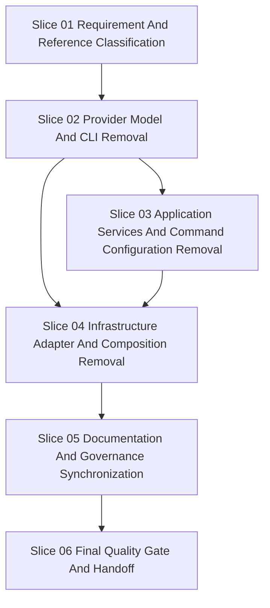

# Workflow: Remove Multipass Legacy Provider

## Metadata

```yaml
workflow_id: remove-multipass-legacy-v1.0.0
created: 2026-06-02
branch: feature/workflow-remove-multipass-legacy-20260602
status: READY_FOR_EXECUTION
request: "Remove the complete Multipass legacy/fallback provider surface, including explicit --node-provider multipass_legacy."
process_strand: S3D
execution_profile: FULL_PATH
primary_boundary: Node provider architecture
secondary_boundaries:
  - Python automation
  - Command configuration
  - Host preflight
  - Documentation governance
  - Test and quality contracts
live_infrastructure_default: false
subagents_enabled: true
```

## Executive Summary

Tiny Swarm World is now LXC-native through LXD or Incus and must no longer
retain Multipass as an explicit legacy or fallback provider. This workflow
removes the `multipass_legacy` product surface end to end: CLI selection,
domain provider models, application services, infrastructure adapters,
Multipass command YAML, tests, and documentation.

The work is FULL_PATH because it changes runtime provider scope, architecture
documentation, command configuration, test contracts, and public usage
instructions. No live infrastructure command is authorized. Verification uses
static inspection, Python unit tests, architecture gates, and the repository
quality gate.

## Requirement Clarification Gate

```yaml
gate: requirement_clarification
status: READY_FOR_WORKFLOW
confidence: 0.94
decision: READY_FOR_WORKFLOW
clarification_attempts: 1
```

Original request:

- "`Legacy/Fallback-Oberflaeche fuer explizites --node-provider multipass_legacy`
  can be removed completely."
- "Create a workflow create with subagents."

Interpreted intent:

- Remove Multipass from supported and documented product behavior.
- Remove `--node-provider multipass_legacy` as an accepted user-facing mode.
- Remove Multipass-specific source modules, command YAML, tests, and docs where
  they no longer describe supported behavior.
- Keep the project Linux/WSL-only, Docker Swarm first, and LXC-native through
  LXD or Incus.

Change type:

- Product scope reduction.
- Architecture and documentation synchronization.
- Python automation cleanup.
- Test contract update.

Affected process strand:

- S3D workflow execution with subagent review.

Affected architecture area:

- Node provider selection.
- Host preflight.
- Command workflow configuration.
- Infrastructure adapter composition.
- User, deployment, system, and arc42 documentation.

Explicit requirements:

- Remove the complete Multipass legacy/fallback provider surface.
- Remove explicit `--node-provider multipass_legacy`.
- Use subagents in the workflow.

Implicit requirements:

- Preserve hexagonal architecture boundaries.
- Keep default provider direction LXC-native through LXD or Incus.
- Do not run live Multipass, LXC, Docker Swarm, compose, or service bootstrap
  commands.
- Update tests and documentation so no supported workflow mentions Multipass.
- Preserve unrelated user changes.

Assumptions:

- Historical audit files may retain Multipass references only when clearly
  archival and not used as current instructions.
- Skills or governance registry entries that mention Multipass are reviewed
  separately from product runtime code; remove or update them only when they
  state current product support.
- VM-neutral concepts may remain only if they are still needed by LXC-native or
  Incus/LXD behavior.

Non-goals:

- No Java, Maven, Spring Boot, React frontend, Kubernetes-first behavior, or
  new external static-analysis CI.
- No live infrastructure mutation.
- No service-stack deployment changes except references needed to remove
  Multipass assumptions.
- No unrelated cleanup of legacy files outside the Multipass removal surface.

Risks:

- Multipass terms are used both as product behavior and as historical audit
  evidence; execution must distinguish current support from archive text.
- VM abstractions may be reused by non-Multipass code and must not be removed
  blindly.
- Removing provider enum values and config validation can cascade through CLI,
  preflight, composition, and tests.
- Documentation can drift if README, user guide, arc42, and deployment docs are
  not updated in the same workflow.

Open questions:

- None blocking.

Blocking questions:

- None.

## Execution Profile

```text
executionProfile=FULL_PATH
reason=The workflow changes provider architecture, CLI behavior, runtime preflight, command YAML, tests, and public documentation.
requiredFullReviews=Senior Requirement Engineer, Senior System Architect, Senior Python Automation Developer, Senior React Frontend Developer impact check, Senior Tester, Senior Documentation Engineer, Senior DevOps Engineer
allowedImpactChecks=Senior React Frontend Developer may record N/A because repository evidence says this is not a React frontend project.
requiredQualityChecks=targeted unittest gates, python3 tools/quality_gate.py arch-tests, python3 tools/quality_gate.py test, python3 tools/quality_gate.py quality, git diff --check
stopConditions=unclear current-vs-archive references, architecture ambiguity, live infrastructure requirement, failing quality gate, or overlapping file locks
```

## Verified Baseline At Authoring

- Active branch verified:
  `feature/workflow-remove-multipass-legacy-20260602`.
- Root `AGENTS.md` states Multipass is retained only as explicit
  legacy/fallback, and the user superseded that product scope for this
  workflow.
- `QUALITY.md` defines the quality gate as
  `python3 tools/quality_gate.py quality`.
- Multipass references currently exist in source, tests, `infra/config`,
  `infra/swarm`, README, user docs, system docs, arc42, skill docs, and active
  workflow artifacts.
- `infra/config/multipass` currently contains five Multipass command YAML files.
- `infra/config/docker` currently contains Multipass Docker/Swarm command YAML.
- Multipass services currently exist under
  `src/tiny_swarm_world/application/services/multipass`.
- Multipass infrastructure clients currently exist under
  `src/tiny_swarm_world/infrastructure/adapters/clients`.

## Target Picture

After `workflow execute with subagents` completes:

- CLI help and argument handling no longer accept or advertise
  `multipass_legacy`.
- Domain provider models and preflight configuration no longer define
  Multipass as a supported provider or runtime dependency.
- Application and infrastructure Multipass modules are removed or replaced with
  LXC-native equivalents where needed.
- Multipass command YAML under `infra/config` is removed.
- Tests no longer assert Multipass legacy support; regression tests prove the
  remaining LXC-native provider path.
- README, user guide, deployment, system, and arc42 docs consistently state
  LXC-native through LXD/Incus as the supported node-provider direction.
- Archival Multipass references are either removed from current guidance or
  clearly marked historical.
- Required quality gates pass without live infrastructure.

## Architecture Constraints

- Domain code remains independent from application and infrastructure.
- Application services depend on ports and domain objects, not concrete
  infrastructure adapters.
- Infrastructure adapters own command runners, filesystem details, HTTP
  clients, preflight probes, and YAML handling.
- Standard runtime wiring remains in
  `src/tiny_swarm_world/infrastructure/composition.py`.
- Entry-point code remains thin.
- No Windows-specific or PowerShell behavior is introduced.
- No live `multipass`, `lxc`, `incus`, `docker swarm`, compose, netplan, socat,
  Nexus, Jenkins, Portainer, RabbitMQ, SonarQube, or Swagger/NGINX commands run
  during verification.

## Python Automation Assessment

This workflow affects Python source in domain, application, infrastructure,
composition, and tests. Removal must be dependency-driven:

- remove or rewrite references from outer layers inward;
- keep provider selection behavior explicit and test-backed;
- remove command YAML contracts only after tests no longer depend on them;
- verify package exports and CLI help do not expose removed names.

## Frontend Assessment

Senior React Frontend Developer impact: N/A. Repository governance states Tiny
Swarm World is not a React frontend project. No browser frontend module,
package tooling, or React component is in scope.

Console/status UI text may need updates if it displays Multipass provider names.
That work routes to Python automation and console/status UI review, not React.

## Test Strategy

Use targeted gates first:

- `PYTHONPATH=src python3 -m unittest tests.domain.node_provider.test_provider_model`
- `PYTHONPATH=src python3 -m unittest tests.application.services.platform.test_node_provider_selection`
- `PYTHONPATH=src python3 -m unittest tests.application.services.platform.test_preflight_service`
- `PYTHONPATH=src python3 -m unittest tests.infrastructure.adapters.repositories.test_node_provider_config_yaml_repository`
- `PYTHONPATH=src python3 -m unittest tests.test_package_entrypoint`
- `python3 tools/quality_gate.py arch-tests`
- `python3 tools/quality_gate.py test`

Required final gate:

- `python3 tools/quality_gate.py quality`
- `git diff --check`

## Resilience Requirements

- Removal must fail closed: unsupported `multipass_legacy` selection must
  produce a clear validation error instead of silently selecting another
  provider.
- Preflight must not probe Multipass once the provider is removed.
- Command workflow validation must not expect removed YAML.
- Documentation must not claim unimplemented compatibility.

## Subagent Orchestration

One write-capable implementation worker owns file mutations. Subagents are
read-only reviewers unless a later execution workflow explicitly delegates a
bounded write slice.

Subagents:

- `requirements_reviewer`: Senior Requirement Engineer, validates scope,
  acceptance criteria, and current-vs-archive distinctions.
- `architecture_reviewer`: Senior System Architect, validates provider boundary,
  hexagonal imports, composition, and arc42 alignment.
- `python_worker`: Senior Python Automation Developer, sequential
  implementation owner.
- `test_reviewer`: Senior Tester, validates regression coverage and quality
  gates.
- `documentation_reviewer`: Senior Documentation Engineer, validates README,
  user guide, deployment, system, and arc42 consistency.
- `devops_reviewer`: Senior DevOps Engineer, validates no live infrastructure
  commands and command YAML cleanup.
- `react_impact_reviewer`: Senior React Frontend Developer, records N/A impact
  only.

## Ordered Slices

### Slice 01 - Requirement And Reference Classification

```yaml
slice_id: "01"
profile: FULL_PATH
owner: Senior Requirement Engineer
secondary_reviewers:
  - Senior Documentation Engineer
  - Senior System Architect
affected_files:
  - documentation/workflow/**
  - README.md
  - documentation/**
  - AGENTS.md
affected_modules:
  - workflow governance
  - documentation
affected_contracts:
  - node-provider-support-contract
dependencies: []
parallel_group: serial-01
file_locks:
  - workflow-documents
  - current-support-documentation
contract_locks:
  - node-provider-support-contract
architecture_locks:
  - provider-scope
quality_gates:
  targeted:
    - git diff --check
  required:
    - git diff --check
documentation:
  arc42: check-and-update
  adr: check-needed
stop_conditions:
  - A Multipass reference cannot be classified as current support, historical archive, or removable dead code.
  - Root governance and user request conflict in a way that requires owner decision.
```

Done criteria:

- Current support references are separated from archival audit references.
- Non-goals and stop conditions are confirmed.
- ADR need is decided before implementation proceeds.

### Slice 02 - Provider Model And CLI Removal

```yaml
slice_id: "02"
profile: FULL_PATH
owner: Senior Python Automation Developer
secondary_reviewers:
  - Senior System Architect
  - Senior Tester
affected_files:
  - src/tiny_swarm_world/domain/node_provider/provider_model.py
  - src/tiny_swarm_world/domain/preflight/preflight_configuration.py
  - src/tiny_swarm_world/application/services/platform/node_provider_selection.py
  - src/tiny_swarm_world/__main__.py
  - tests/domain/node_provider/test_provider_model.py
  - tests/application/services/platform/test_node_provider_selection.py
  - tests/test_package_entrypoint.py
affected_modules:
  - tiny_swarm_world.domain.node_provider
  - tiny_swarm_world.domain.preflight
  - tiny_swarm_world.application.services.platform
  - tiny_swarm_world.__main__
affected_contracts:
  - NodeProviderKind
  - ProviderSelection
  - CLI node-provider options
dependencies:
  - "01"
parallel_group: serial-02
file_locks:
  - provider-model
  - cli-entrypoint
contract_locks:
  - node-provider-support-contract
architecture_locks:
  - domain-application-boundary
quality_gates:
  targeted:
    - PYTHONPATH=src python3 -m unittest tests.domain.node_provider.test_provider_model
    - PYTHONPATH=src python3 -m unittest tests.application.services.platform.test_node_provider_selection
    - PYTHONPATH=src python3 -m unittest tests.test_package_entrypoint
  required:
    - python3 tools/quality_gate.py arch-tests
documentation:
  arc42: update-provider-decision
  adr: check-needed
stop_conditions:
  - CLI behavior would silently map multipass_legacy to another provider.
  - Domain model removal breaks LXC-native provider selection semantics.
```

Done criteria:

- `multipass_legacy` is not accepted by supported CLI options.
- Provider selection tests cover remaining valid providers and removed-provider
  failure behavior.
- Domain provider model no longer exposes Multipass support.

### Slice 03 - Application Services And Command Configuration Removal

```yaml
slice_id: "03"
profile: FULL_PATH
owner: Senior Python Automation Developer
secondary_reviewers:
  - Senior DevOps Engineer
  - Senior Tester
affected_files:
  - src/tiny_swarm_world/application/services/multipass/**
  - src/tiny_swarm_world/application/services/platform/__init__.py
  - src/tiny_swarm_world/application/services/platform/preflight_service.py
  - src/tiny_swarm_world/application/services/vm/**
  - src/tiny_swarm_world/application/services/network/netplant/**
  - src/tiny_swarm_world/application/services/commands/command_builder/vm_parameter/**
  - infra/config/multipass/**
  - infra/config/docker/command_multipass_*.yaml
  - infra/config/vm/**
  - infra/config/network/netplant/**
  - tests/application/services/multipass/**
  - tests/application/services/platform/test_command_verification_contracts.py
  - tests/infrastructure/adapters/command_runner/test_command_workflow_configuration.py
affected_modules:
  - tiny_swarm_world.application.services.multipass
  - tiny_swarm_world.application.services.platform
  - command configuration
affected_contracts:
  - CommandWorkflowId
  - command YAML workflow configuration
dependencies:
  - "02"
parallel_group: serial-03
file_locks:
  - application-multipass-services
  - command-yaml-config
contract_locks:
  - command-workflow-configuration
architecture_locks:
  - application-depends-on-ports
quality_gates:
  targeted:
    - PYTHONPATH=src python3 -m unittest tests.application.services.platform.test_command_verification_contracts
    - PYTHONPATH=src python3 -m unittest tests.infrastructure.adapters.command_runner.test_command_workflow_configuration
  required:
    - python3 tools/quality_gate.py test
documentation:
  arc42: update-runtime-and-building-blocks
  adr: check-needed
stop_conditions:
  - A VM or netplan module is still required by LXC-native behavior and cannot be safely removed.
  - Command YAML removal would leave dangling workflow validation references.
```

Done criteria:

- Multipass application services are removed from exports and tests.
- Multipass command YAML files are removed.
- Remaining command workflow tests reflect supported LXC-native behavior only.

### Slice 04 - Infrastructure Adapter And Composition Removal

```yaml
slice_id: "04"
profile: FULL_PATH
owner: Senior Python Automation Developer
secondary_reviewers:
  - Senior System Architect
  - Senior DevOps Engineer
  - Senior Tester
affected_files:
  - src/tiny_swarm_world/infrastructure/adapters/clients/multipass_*.py
  - src/tiny_swarm_world/infrastructure/adapters/preflight/host_preflight_probe.py
  - src/tiny_swarm_world/infrastructure/adapters/repositories/node_provider_config_yaml_repository.py
  - src/tiny_swarm_world/infrastructure/adapters/repositories/vm_repository_yaml.py
  - src/tiny_swarm_world/infrastructure/composition.py
  - infra/config/node-providers/provider_config.yaml
  - tests/infrastructure/adapters/clients/test_multipass_*.py
  - tests/infrastructure/adapters/preflight/test_host_preflight_probe.py
  - tests/infrastructure/adapters/repositories/test_node_provider_config_yaml_repository.py
  - tests/infrastructure/test_composition.py
affected_modules:
  - tiny_swarm_world.infrastructure.adapters.clients
  - tiny_swarm_world.infrastructure.adapters.preflight
  - tiny_swarm_world.infrastructure.adapters.repositories
  - tiny_swarm_world.infrastructure.composition
affected_contracts:
  - host-preflight-probe
  - node-provider-config-yaml
  - composition-container
dependencies:
  - "02"
  - "03"
parallel_group: serial-04
file_locks:
  - infrastructure-multipass-adapters
  - composition
  - node-provider-config
contract_locks:
  - runtime-adapter-contract
  - provider-config-contract
architecture_locks:
  - infrastructure-implements-ports
quality_gates:
  targeted:
    - PYTHONPATH=src python3 -m unittest tests.infrastructure.adapters.repositories.test_node_provider_config_yaml_repository
    - PYTHONPATH=src python3 -m unittest tests.infrastructure.test_composition
    - PYTHONPATH=src python3 -m unittest tests.infrastructure.adapters.preflight.test_host_preflight_probe
  required:
    - python3 tools/quality_gate.py arch-tests
    - python3 tools/quality_gate.py test
documentation:
  arc42: update-deployment-and-concepts
  adr: check-needed
stop_conditions:
  - Composition still constructs removed Multipass adapters.
  - Preflight still executes or expects Multipass probes.
  - Provider config schema requires a legacy fallback.
```

Done criteria:

- Multipass infrastructure adapters and tests are gone or rewritten to
  remaining provider behavior.
- Composition does not register Multipass clients.
- Provider config validation no longer requires `multipass_legacy`.

### Slice 05 - Documentation And Governance Synchronization

```yaml
slice_id: "05"
profile: FULL_PATH
owner: Senior Documentation Engineer
secondary_reviewers:
  - Senior Requirement Engineer
  - Senior System Architect
  - Senior Tester
affected_files:
  - README.md
  - AGENTS.md
  - documentation/arc42/**
  - documentation/deployment/**
  - documentation/system/**
  - documentation/user_guide/**
  - documentation/epics/**
  - documentation/architecture/**
  - documentation/skill-audit/**
  - .agents/skills/**
affected_modules:
  - documentation
  - governance
affected_contracts:
  - product-operating-model
  - node-provider-documentation
dependencies:
  - "02"
  - "03"
  - "04"
parallel_group: serial-05
file_locks:
  - documentation-provider-scope
  - arc42-provider-scope
contract_locks:
  - product-operating-model
architecture_locks:
  - architecture-documentation-consistency
quality_gates:
  targeted:
    - git diff --check
    - rg -n "multipass|Multipass|multipass_legacy" README.md documentation AGENTS.md .agents
  required:
    - git diff --check
documentation:
  arc42: update
  adr: check-needed
stop_conditions:
  - Current user guidance still presents Multipass as supported.
  - Archival references are ambiguous and could be read as current behavior.
```

Done criteria:

- Current docs no longer advertise Multipass support.
- arc42 constraints, context, solution strategy, building blocks, deployment
  view, risks, and glossary align with LXC-native only support.
- Any retained historical references are explicitly archival.

### Slice 06 - Final Quality Gate And Handoff

```yaml
slice_id: "06"
profile: FULL_PATH
owner: Senior Tester
secondary_reviewers:
  - Senior Python Automation Developer
  - Senior System Architect
  - Senior Documentation Engineer
affected_files:
  - src/**
  - tests/**
  - infra/config/**
  - documentation/**
  - README.md
affected_modules:
  - full repository quality surface
affected_contracts:
  - quality-gate-contract
dependencies:
  - "05"
parallel_group: serial-06
file_locks:
  - final-verification
contract_locks:
  - quality-gate-contract
architecture_locks:
  - hexagonal-architecture
quality_gates:
  targeted:
    - python3 tools/quality_gate.py arch-tests
    - python3 tools/quality_gate.py test
    - git diff --check
  required:
    - python3 tools/quality_gate.py quality
    - git diff --check
documentation:
  arc42: checked
  adr: checked
stop_conditions:
  - Any required quality gate fails.
  - Removed Multipass behavior is still reachable through CLI, composition, config, tests, or current documentation.
```

Done criteria:

- Full quality gate passes or a typed blocker report is produced.
- `rg` evidence proves no current support references remain.
- Handoff to commit/push is ready only after the user requests it.

## Dependency Graph



## Parallelization Opportunities

Default execution is serial because provider model, command configuration,
composition, tests, and documentation share the same product contract. Read-only
subagent reviews may run in parallel after each slice, but the implementation
worker remains sequential.

Potential parallel read-only reviews:

- Documentation reviewer can classify references during Slice 01.
- React impact reviewer can record N/A at any point after Slice 01.
- Tester can inspect expected failing tests while Python worker handles Slice 02.

## Documentation Synchronization Points

- Slice 01: classify docs as current guidance versus archival evidence.
- Slice 02: update provider-selection docs after CLI contract changes.
- Slice 04: update architecture docs after composition and adapter removal.
- Slice 05: synchronize README, user guide, deployment docs, system docs, arc42,
  skill audit, and governance references.
- Slice 06: record final verification evidence.

## Stop Conditions

Stop workflow execution when:

- required branch verification fails;
- unrelated local changes overlap with slice write scopes;
- any slice would require live infrastructure commands;
- current support versus archival Multipass evidence cannot be distinguished;
- provider removal requires an ADR and no ADR decision exists;
- a quality gate fails and the Typed Error Router cannot classify it locally;
- architecture checks indicate boundary drift.

## Uncertainty Escalation Rules

- Requirement ambiguity routes to Senior Requirement Engineer and the Three
  Amigos gate.
- Architecture ambiguity routes to Senior System Architect and arc42 governance.
- Test or quality ambiguity routes to Senior Tester and quality-gate skills.
- Command or live infrastructure ambiguity routes to Senior DevOps Engineer.
- File lock conflicts route to Senior Execution Orchestrator.

## Commit And Push Plan

No commit or push is authorized by this workflow creation request. During
workflow execution, commit and push are allowed only when the user explicitly
requests them and required quality gates pass.

## Definition Of Done

- Multipass legacy/fallback provider support is removed from source, config,
  tests, and current documentation.
- Remaining provider behavior is LXC-native through LXD or Incus.
- Unsupported Multipass selection fails clearly and is not silently remapped.
- No live infrastructure command was run.
- `python3 tools/quality_gate.py quality` and `git diff --check` pass, or a
  typed blocker report explains the failure.
- arc42 and README/user-facing docs align with the new product scope.

## Handoff To Workflow Execute

Use:

```text
workflow execute
```

Execution must first verify:

- active branch is `feature/workflow-remove-multipass-legacy-20260602`;
- context pack hashes are current;
- slice metadata is complete;
- file locks do not overlap with user changes;
- no live infrastructure commands are requested.

## arc42 Check Status

arc42 impact is required. Execution must update or explicitly check:

- `documentation/arc42/02_constraints.adoc`
- `documentation/arc42/03_solution_strategy.adoc`
- `documentation/arc42/04_context_and_scope.adoc`
- `documentation/arc42/05_building_blocks.adoc`
- `documentation/arc42/07_deployment_view.adoc`
- `documentation/arc42/09_architecture_decisions.adoc`
- `documentation/arc42/10_quality_requirements.adoc`
- `documentation/arc42/11_risks_and_debt.adoc`
- `documentation/arc42/12_glossary.adoc`

ADR status: check required during Slice 01. If removal changes an existing
architecture decision rather than only completing it, create or update the
appropriate ADR before implementation continues.
