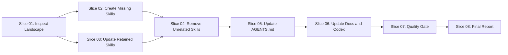

# Workflow: Consolidate Tiny Swarm World Skills and Agents

## Executive Summary

This workflow creates the governed execution plan for consolidating the Tiny
Swarm World skill and agent landscape.

Tiny Swarm World is a Python-based, hexagonally structured local infrastructure
automation system for Multipass, Docker Swarm, local registry, CI, quality,
platform services, console status output, and future Kubernetes compatibility.
The workflow keeps required project skills, adds missing Python, pip and
setup/bootstrap skills, removes unrelated skills only after reference checks,
updates `AGENTS.md` and related documentation, and ensures all agent references
match actual skill files.

This workflow is governance and documentation work. It must not implement
product functionality, run live infrastructure operations, or change Python
runtime behavior. Direct reference corrections may touch non-executable
metadata only when they are strictly necessary for skill or agent wiring.

## Target Picture

### Verified Baseline At Workflow Creation

- Active workflow branch:

```bash
feature/workflow-tiny-swarm-skills-agents-20260523
```

- Root `AGENTS.md` exists and defines Tiny Swarm World as a Linux/WSL-only
  Python automation project with hexagonal architecture.
- Root `QUALITY.md` exists and defines the preferred quality gate:

```bash
python3 tools/quality_gate.py quality
```

- Existing active workflow artifacts under `documentation/workflow/` were
  regenerated for this workflow.
- This workflow supersedes the previous active init-safety/boundary workflow
  package in `documentation/workflow/`. The previous workflow was not kept as
  an active file because the repository workflow-authoring rule requires full
  regeneration for a new workflow.
- The repository uses `documentation/` for project documentation. No root
  `docs/` directory exists at workflow creation time.
- No `.codex/prompts/` directory exists at workflow creation time.
- `.codex/skills/hexagonal-architecture-expert/SKILL.md` exists.
- Exact required project skill names such as `tdd-expert`,
  `bdd-expert`, `python-senior-developer`,
  `python-pip-packaging-expert`, and `setup-bootstrap-expert` are missing
  from `.agents/skills/` at workflow creation time.
- `.agents/skills/microservice-senior-expert/SKILL.md` exists and is a
  removal candidate under the target structure.
- `.codex/agents/`, `.codex/subagents/`, `.agents/roles/`, and
  `.agents/skills/` contain existing reusable and project-specific role
  definitions that must be checked before deletion or replacement.
- `.agents/prompts/skills-update.md` references
  `documentation/agents/skill-registry.md` and
  `documentation/agents/organigramm.md`, while
  `.agents/skills/skill-registry-conflict-auditor/SKILL.md` owns
  `documentation/skill-audit/skill-registry.md` and
  `documentation/skill-audit/skill-registry.json`. Neither directory exists at
  workflow creation time, so execution must resolve this source-of-truth
  conflict before deleting or renaming skills.
- `.agents/orchestrator/routing-rules.md` references Organigramm Maintainer,
  Process Governance Maintainer, Root Architect, and Typed Error Router
  concepts. Some are escalation concepts or missing named owners rather than
  existing role files, so execution must create or map ownership explicitly.
- `documentation/process/skill-agent-creation.md` says project skills live as
  `.agents/skills/<name>/SKILL.md`, while the requested target tree uses
  grouped `.md` files such as `.agents/skills/python/python-senior-developer.md`.
  Execution must resolve this format conflict before creating skills so the
  final structure is both target-aligned and discoverable by local skill
  tooling.
- `documentation/epics/` and `documentation/adr/` are absent at workflow
  creation time.
- `documentation/arc42/` exists and was checked for architecture context.

### Target Outcome

The completed workflow must produce:

- a dedicated branch for the workflow;
- a complete target skill tree under `.agents/skills/`;
- an explicit skill-file format decision that reconciles the requested grouped
  `.md` tree with the existing `.agents/skills/<name>/SKILL.md` process rule;
- a canonical skill registry and organigramm path decision, preferably
  `documentation/skill-audit/skill-registry.md`,
  `documentation/skill-audit/skill-registry.json`, and an explicitly chosen
  organigramm or owner-map path;
- all required Python, pip and setup/bootstrap skills;
- retained skills updated for Tiny Swarm World;
- unrelated skills deleted only when all references are resolved;
- root `AGENTS.md` updated with the root agent, hierarchy, skill groups,
  forbidden unrelated skills, stop rules, and execution rules;
- documentation updated to explain the current skill structure, agent
  structure, workflow execution rules, skill addition, skill removal, and
  subagent assignment;
- `.codex/agents/`, `.codex/subagents/`, `.codex/skills/`, and
  `.codex/workflow/` references aligned with actual project skills where
  they remain in scope;
- `.agents/prompts/` and `.agents/orchestrator/` routing references aligned
  with the selected registry, organigramm, Root Architect, and Typed Error
  Router ownership model;
- no unresolved dead references in `AGENTS.md`, README, documentation,
  `.agents/`, or `.codex/`;
- quality checks executed and reported;
- a final report answering consistency, required-skill, unrelated-skill, and
  unresolved-reference questions.

## Requirement Clarification Record

Original request:

```text
workflow create with subagents: create the Tiny Swarm World workflow template
for consolidating skills and agents, including branch rule, target skill
structure, agent model, slices, quality gate and final report.
```

Interpreted intent:

- Create a new active repository workflow for future `workflow execute`.
- Use delegated subagent review during workflow creation.
- Preserve Linux/WSL-only, Python automation, hexagonal architecture, Docker
  Swarm-first runtime, and future Kubernetes-aware constraints.
- Plan consolidation of `.agents`, `.codex`, `AGENTS.md`, README, and
  documentation references without executing the consolidation in this turn.

Change type:

- Workflow creation and governance planning.

Affected process strand:

- Skills, agents, registry, organigramm, workflow governance, documentation
  synchronization, process routing, and quality-gate reporting.

Affected architecture area:

- Process architecture and repository governance only. Product runtime
  architecture is not changed by workflow creation.

Explicit requirements:

- Create and verify the workflow branch before file mutations.
- Stop if the working tree is dirty before branch creation.
- Keep required skills.
- Add missing Python, pip/packaging, setup/bootstrap, and platform skills.
- Treat `setup-bootstrap-expert` as a core skill.
- Clarify `frontend-developer` as console status UI responsibility, not a
  browser-first React role.
- Remove unrelated skills only after reference checks.
- Update `AGENTS.md`, documentation, and Codex-related references.
- Use ordered workflow slices with subagent ownership.
- Run quality checks and produce a final report.

Implicit requirements:

- Normalize the requested `docs/` paths to this repository's existing
  `documentation/` path unless execution intentionally creates a new docs
  structure.
- Treat `.codex/agents/` and `.codex/subagents/` as active agent-reference
  surfaces because they exist in the repository.
- Treat `.agents/prompts/` and `.agents/orchestrator/` as active
  process-routing surfaces because they exist in the repository.
- Preserve root `QUALITY.md` as the source for quality commands.
- Preserve root `AGENTS.md` as the source for architecture and external-system
  safety.

Assumptions:

- The user wants workflow authoring now and workflow execution later.
- The old `documentation/workflow/` package is replaced by this new active
  workflow according to the local workflow-authoring rule. It can be recovered
  from Git history if needed.
- Missing target skills will be created during workflow execution, not during
  workflow creation.
- `frontend-developer` remains allowed only as a console status UI skill unless
  a separate explicit browser-frontend workflow verifies a frontend module,
  package tooling, and quality gates.

Non-goals:

- No product functionality.
- No runtime Python source changes.
- No Docker, Multipass, Swarm, compose, netplan, service bootstrap, or port
  forwarding execution.
- No speculative Spring Boot, React browser app, database, graph, vector, gRPC,
  JavaParser, Joern, or forensic analytics ownership.
- No external static-analysis CI configuration.

Risks:

- Existing `.codex` agent names include forensic analytics, React frontend,
  microservice, Java and UX roles that may become dead or misleading after
  consolidation.
- Registry and organigramm source-of-truth paths currently conflict between
  `.agents/prompts/skills-update.md` and the dedicated
  `skill-registry-conflict-auditor` skill.
- Organigramm Maintainer and Process Governance Maintainer are referenced
  routing owners but are not present as role files at workflow creation time.
- The requested target skill tree uses grouped `.md` files, but the existing
  local process says skills are directory-based `SKILL.md` entrypoints. A
  `.md`-only implementation may be invisible to skill discovery unless the
  process docs and runtime expectations are updated or compatibility wrappers
  are created.
- The target skill tree is broad. Parallel execution must use strict file
  ownership to avoid merge conflicts.
- Deleting a skill before resolving references would break subagent routing.
- Creating a parallel `docs/` directory would conflict with the current
  repository documentation model.

Open questions:

- None blocking for workflow creation.

Blocking questions:

- None.

Confidence level:

```text
96 percent
```

Decision:

```text
READY_FOR_WORKFLOW
```

## Scope

### Allowed Write Scope

The workflow may change:

```text
AGENTS.md
.agents/
.agents/skills/
.agents/roles/
.agents/prompts/
.agents/orchestrator/
.codex/
.codex/agents/
.codex/skills/
.codex/subagents/
.codex/workflow/
documentation/
documentation/process/
documentation/skill-audit/
documentation/workflow/
documentation/workplan/
README.md
```

The user-supplied `docs/`, `docs/workflows/`, and `docs/workplan/` scope maps
to `documentation/`, `documentation/workflow/`, and
`documentation/workplan/` in this repository unless a slice records an explicit
decision to introduce `docs/`.

### Forbidden Write Scope

The workflow must not change:

```text
src/tiny_swarm_world/**
src/main/java/**
infra/**
docker/**
bin/**
tools/**
requirements.txt
setup.py
pom.xml
Dockerfiles
docker-compose files
stack files
runtime scripts
```

Exception: a direct reference correction may touch a forbidden area only when
the target is non-executable metadata, the reference is explicitly about skill
or agent wiring, the change is minimal, and the slice report documents why no
allowed-scope file could own it. Any executable Python source, `tools/**`,
`requirements.txt`, or `setup.py` change requires a STOP and a separate
implementation workflow.

## Architecture Constraints

- Preserve the existing hexagonal architecture.
- Domain, application, infrastructure, command YAML, and runtime wiring are out
  of scope.
- Root `AGENTS.md` must continue to state that Tiny Swarm World is Linux/WSL
  only, Python automation first, Docker Swarm first, and Kubernetes-aware but
  not Kubernetes-first.
- Java under `src/main/java` remains a deployment example and must not drive
  the Python automation architecture.
- Skills and agents must not imply that Tiny Swarm World is
  `forensic_analytics`, a Spring Boot application, a React frontend project,
  or a generic microservice migration project.
- Console status UI ownership is terminal/dashboard/status-output oriented.
- Current runtime ownership remains Docker Swarm. Kubernetes skill ownership is
  future-runtime review only.

## Python Automation Assessment

This workflow does not change Python implementation files. Python-related work
is limited to skill and agent guidance for:

- Python automation module design;
- CLI command structure;
- packaging and pip/venv setup;
- testable orchestration logic;
- shell command encapsulation through ports and adapters;
- error handling and logging rules;
- setup/bootstrap validation.

Python, pip, and setup/bootstrap skills must encode Linux/WSL-only setup,
Python 3.12 compatibility, `python3 -m venv .venv`,
`python3 -m pip install -r requirements.txt`, installation of `ruff`, `mypy`,
and `import-linter`, manual `PYTHONPATH=src` requirements, and the distinction
between developer environment bootstrap and service bootstrap scripts.

Any future execution slice that discovers required Python behavior changes must
stop and ask for a separate implementation workflow.

## Frontend Assessment

Tiny Swarm World is not currently a browser-first frontend project. The
retained `frontend-developer` responsibility must be reinterpreted as
console-status UI work:

- console status output;
- terminal dashboards;
- progress visualization;
- service, node, stack and healthcheck status display;
- error and recovery guidance.

The mandatory workflow-authoring frontend review role is included only to
validate that the workflow does not accidentally introduce React or browser UI
scope.

Any need for `package.json`, React, Vite, Next.js, browser routes, API client
UI adapters, or `.tsx` or `.jsx` files requires a separate frontend workflow.

## Resilience And Safety Requirements

- Do not run live infrastructure commands.
- Do not run `multipass`, Docker Swarm mutations, compose deployments,
  netplan changes, `socat`, or service bootstrap scripts.
- Do not delete a skill before all references have been searched and resolved.
- If confidence drops below 95 percent during execution, stop and report.
- If a skill is still referenced and no safe replacement exists, keep it and
  report the unresolved reference.
- Do not invent external tools or absent project structures.
- Do not merge unrelated cleanups into one undocumented change.

## Required Skill Groups

### Quality And Testing

```text
tdd-expert
bdd-expert
platform-quality-gates
acceptance-checks
```

### Architecture And Evolution

```text
hexagonal-architecture-expert
mapping-dsl-expert
strangler-command-adapter-pattern
sca-migration-expert
llm-analysis-expert
kubernetes-expert
```

### Core Python And Bootstrap

```text
python-senior-developer
python-pip-packaging-expert
setup-bootstrap-expert
python-cli-automation
python-test-automation
```

### Platform-Specific Groups

```text
tiny-swarm-world-system-architecture
platform-layout-governance
workflow-orchestration
multipass-vm-provisioning
linux-host-preparation
network-topology-design
docker-engine-installation
docker-swarm-initialization
swarm-node-management
swarm-stack-deployment
swarm-volume-network-governance
registry-infrastructure
nexus-bootstrap
docker-registry-bootstrap
maven-repository-bootstrap
image-build-publish
image-versioning-tagging
image-verification
jenkins-bootstrap
sonarqube-bootstrap
portainer-bootstrap
swagger-ui-bootstrap
reverse-proxy-routing
platform-verification
platform-reset-and-recovery
observability-and-diagnostics
secrets-and-config-management
idempotent-platform-automation
documentation-generation
```

### Console UI

```text
frontend-developer
console-status-ui-developer
terminal-status-dashboard
```

## Target Skill Directory Structure

```text
.agents/skills/
  tiny-swarm-world/
    tiny-swarm-world-system-architecture.md
    platform-layout-governance.md
    workflow-orchestration.md
    hexagonal-architecture-expert.md
  provisioning/
    multipass-vm-provisioning.md
    linux-host-preparation.md
    network-topology-design.md
    setup-bootstrap-expert.md
  python/
    python-senior-developer.md
    python-pip-packaging-expert.md
    python-cli-automation.md
    python-test-automation.md
  docker-swarm/
    docker-engine-installation.md
    docker-swarm-initialization.md
    swarm-node-management.md
    swarm-stack-deployment.md
    swarm-volume-network-governance.md
  registry/
    registry-infrastructure.md
    nexus-bootstrap.md
    docker-registry-bootstrap.md
    maven-repository-bootstrap.md
  images/
    image-build-publish.md
    image-versioning-tagging.md
    image-verification.md
  services/
    jenkins-bootstrap.md
    sonarqube-bootstrap.md
    portainer-bootstrap.md
    swagger-ui-bootstrap.md
    reverse-proxy-routing.md
  console-ui/
    frontend-developer.md
    console-status-ui-developer.md
    terminal-status-dashboard.md
  quality/
    tdd-expert.md
    bdd-expert.md
    platform-quality-gates.md
    acceptance-checks.md
  architecture/
    mapping-dsl-expert.md
    strangler-command-adapter-pattern.md
    sca-migration-expert.md
  intelligence/
    llm-analysis-expert.md
  future-runtime/
    kubernetes-expert.md
  operations/
    platform-verification.md
    platform-reset-and-recovery.md
    observability-and-diagnostics.md
    secrets-and-config-management.md
    idempotent-platform-automation.md
    documentation-generation.md
```

Each skill file must define:

```text
Purpose
Responsibilities
Inputs
Outputs
Boundaries
STOP conditions
Collaboration with other skills
Quality expectations
```

## Agent Model

### Root Agent

```text
tiny-swarm-world-lead-architect
```

Responsibilities:

- owns the full skill and agent structure;
- decides whether a skill belongs to Tiny Swarm World;
- prevents project drift;
- enforces workflow boundaries;
- coordinates subagents.

### Subagent Hierarchy

```mermaid
flowchart TD
    ROOT["tiny-swarm-world-lead-architect"]

    ROOT --> GOV["Governance"]
    ROOT --> PROV["Provisioning"]
    ROOT --> PY["Python Automation"]
    ROOT --> SWARM["Docker Swarm"]
    ROOT --> REG["Registry & Images"]
    ROOT --> SVC["Platform Services"]
    ROOT --> OPS["Operations"]
    ROOT --> QA["Quality"]
    ROOT --> EVO["Evolution / Future"]

    GOV --> GOV1["platform-layout-governance-agent"]
    GOV --> GOV2["workflow-orchestration-agent"]
    GOV --> GOV3["hexagonal-architecture-agent"]

    PROV --> PROV1["setup-bootstrap-agent"]
    PROV --> PROV2["multipass-provisioning-agent"]
    PROV --> PROV3["network-topology-agent"]
    PROV --> PROV4["linux-host-preparation-agent"]

    PY --> PY1["python-senior-developer-agent"]
    PY --> PY2["python-packaging-agent"]
    PY --> PY3["python-cli-automation-agent"]
    PY --> PY4["python-test-automation-agent"]

    SWARM --> SWARM1["docker-engine-agent"]
    SWARM --> SWARM2["docker-swarm-agent"]
    SWARM --> SWARM3["swarm-stack-agent"]
    SWARM --> SWARM4["swarm-network-volume-agent"]

    REG --> REG1["registry-infrastructure-agent"]
    REG --> REG2["nexus-bootstrap-agent"]
    REG --> REG3["docker-registry-agent"]
    REG --> REG4["maven-repository-agent"]
    REG --> REG5["image-build-publish-agent"]
    REG --> REG6["image-verification-agent"]

    SVC --> SVC1["jenkins-bootstrap-agent"]
    SVC --> SVC2["sonarqube-bootstrap-agent"]
    SVC --> SVC3["portainer-bootstrap-agent"]
    SVC --> SVC4["swagger-ui-bootstrap-agent"]
    SVC --> SVC5["reverse-proxy-routing-agent"]

    OPS --> OPS1["platform-verification-agent"]
    OPS --> OPS2["platform-reset-recovery-agent"]
    OPS --> OPS3["observability-diagnostics-agent"]
    OPS --> OPS4["secrets-config-agent"]
    OPS --> OPS5["documentation-generation-agent"]

    QA --> QA1["tdd-agent"]
    QA --> QA2["bdd-agent"]
    QA --> QA3["acceptance-check-agent"]
    QA --> QA4["platform-quality-gate-agent"]

    EVO --> EVO1["llm-analysis-agent"]
    EVO --> EVO2["mapping-dsl-agent"]
    EVO --> EVO3["sca-migration-agent"]
    EVO --> EVO4["kubernetes-future-runtime-agent"]
    EVO --> EVO5["console-status-ui-agent"]
```



### Current Callable Role Mapping

Until project-specific callable agents are regenerated, use these existing
callable roles or local role files as reviewers:

| Target responsibility | Existing callable role or file |
| --- | --- |
| Workflow creation and dependency ordering | `senior_workflow_architect` |
| Requirement drift and acceptance criteria | `senior_requirement_engineer` |
| Architecture boundaries and arc42 | `senior_system_architect` |
| Python automation constraints | `senior_python_automation_developer` |
| Frontend scope guard | `senior_react_frontend` as read-only "no React unless a separate frontend workflow verifies it" review |
| Documentation consistency | `senior_documentation_engineer` |
| Quality verification | `senior_tester` or `quality_reviewer` |
| Branch and commit readiness | `git_commit_reviewer` then `git_commit_operator` |

## Subagent Coordination Rules

- Every slice has exactly one accountable owner.
- Reviewers are read-only unless explicitly assigned a write scope.
- Parallel slices may run only when file locks, contract locks, and
  architecture locks do not overlap.
- Subagents must verify the active branch before modifying files.
- Subagents must not switch branches.
- Handoffs must record inputs, outputs, blockers, validation status, and
  unresolved assumptions.
- A reviewer must not be the sole implementer of the decision it reviews.

## Slice Dependency Graph



Parallelization:

- Slices 02 and 03 may run in parallel only if they lock disjoint skill files
  after Slice 01 produces the inventory.
- All deletion work in Slice 04 must wait for Slice 02 and Slice 03.
- Slices 05 and 06 must run after skill path decisions stabilize.
- Slices 07 and 08 are sequential.

## Workflow Slices

### Slice 01: Inspect Existing Skill And Agent Landscape

Purpose:

- Build the authoritative inventory before any skill, agent, or documentation
  change.

```yaml
slice_id: "01"
profile: "FULL_PATH"
owner: "senior_requirement_engineer"
secondary_reviewers:
  - "senior_workflow_architect"
  - "senior_system_architect"
affected_files:
  - ".agents/**"
  - ".agents/prompts/**"
  - ".agents/orchestrator/**"
  - ".codex/**"
  - "AGENTS.md"
  - "README.md"
  - "documentation/**"
affected_modules: []
affected_contracts:
  - "skill-name references"
  - "agent-name references"
  - "skill file format"
  - "registry and organigramm source of truth"
  - "routing owner names"
dependencies: []
parallel_group: "A"
file_locks:
  - ".agents/**"
  - ".codex/**"
  - "AGENTS.md"
  - "README.md"
  - "documentation/**"
contract_locks:
  - "skill-registry"
  - "agent-registry"
  - "skill-file-format"
  - "organigramm-registry"
architecture_locks:
  - "process-governance"
quality_gates:
  targeted:
    - "git status"
  required: []
documentation:
  arc42: "check only; update only if governance model changes architecture docs"
  adr: "not present at workflow creation"
stop_conditions:
  - ".agents directory is missing"
  - "AGENTS.md is missing"
  - "existing structure is incompatible with this workflow"
  - "confidence below 95 percent"
```

Tasks:

- Inspect `.agents/`.
- Inspect `.agents/skills/`.
- Inspect `.agents/roles/`.
- Inspect `.agents/prompts/` and `.agents/orchestrator/`.
- Inspect `.codex/agents/`, `.codex/skills/`, `.codex/subagents/`, and
  `.codex/workflow/`.
- Inspect `AGENTS.md`, `README.md`, and `documentation/`.
- Identify existing skills, agents, duplicates, missing required skills,
  unrelated skills, and dead references.
- Decide and document the canonical skill registry and organigramm paths.
  Preferred registry path:

```text
documentation/skill-audit/skill-registry.md
documentation/skill-audit/skill-registry.json
```

- Map or create explicit ownership for Organigramm Maintainer, Process
  Governance Maintainer, Root Architect escalation, and Typed Error Router.
- Decide and document whether target skills will be implemented as grouped
  `.md` files, existing-style `<skill>/SKILL.md` directories, or both with
  compatibility wrappers. Stop if the chosen format would break skill
  discovery or contradict the user's required target structure without an
  explicit documented exception.
- Write the inventory to `documentation/workflow/reports/01-skill-agent-inventory.md`.

Done criteria:

- Inventory lists current skills, current agents, required changes, candidate
  deletions, unresolved references, and exact files searched.
- Inventory records the registry/organigramm canonical path decision and the
  owner-map decision for missing named process roles.
- Inventory records the skill-file format decision and the affected process
  docs that must be updated.

Verification commands:

```bash
git status
find .agents -type f | sort
find .codex -type f | sort
grep -R "spring-boot-expert\|forensic-analytics-expert\|react-developer" AGENTS.md README.md documentation .agents .codex || true
grep -R "documentation/agents\|documentation/skill-audit\|Organigramm Maintainer\|Process Governance Maintainer\|Typed Error Router" .agents documentation .codex AGENTS.md README.md || true
```

### Slice 02: Create Missing Required Skills

Purpose:

- Create missing required and platform-specific skill files in the target
  `.agents/skills/` structure.

```yaml
slice_id: "02"
profile: "FULL_PATH"
owner: "senior_python_automation_developer"
secondary_reviewers:
  - "senior_system_architect"
  - "senior_tester"
affected_files:
  - ".agents/skills/tiny-swarm-world/**"
  - ".agents/skills/provisioning/**"
  - ".agents/skills/python/**"
  - ".agents/skills/docker-swarm/**"
  - ".agents/skills/registry/**"
  - ".agents/skills/images/**"
  - ".agents/skills/services/**"
  - ".agents/skills/console-ui/**"
  - ".agents/skills/quality/**"
  - ".agents/skills/architecture/**"
  - ".agents/skills/intelligence/**"
  - ".agents/skills/future-runtime/**"
  - ".agents/skills/operations/**"
affected_modules: []
affected_contracts:
  - "target skill directory structure"
  - "skill file format"
dependencies:
  - "01"
parallel_group: "B"
file_locks:
  - ".agents/skills/**"
contract_locks:
  - "skill-registry"
  - "skill-file-format"
architecture_locks:
  - "process-governance"
quality_gates:
  targeted:
    - "find .agents/skills -type f | sort"
  required: []
documentation:
  arc42: "not expected"
  adr: "not expected"
stop_conditions:
  - "a target skill duplicates another skill's responsibility without clear ownership"
  - "a required skill name conflicts with an existing incompatible file"
  - "confidence below 95 percent"
```

Tasks:

- Create `python-senior-developer`.
- Create `python-pip-packaging-expert`.
- Create `setup-bootstrap-expert` as a core skill.
- Create all missing platform skills from the target structure.
- Follow the Slice 01 skill-file format decision. Do not create `.md`-only
  skill files if local skill discovery still requires `<skill>/SKILL.md`
  entrypoints.
- Ensure every skill contains Purpose, Responsibilities, Inputs, Outputs,
  Boundaries, STOP conditions, Collaboration with other skills, and Quality
  expectations.

Done criteria:

- Every required skill file exists in the target structure.
- Responsibilities are project-specific and do not overlap unnecessarily.

Verification commands:

```bash
find .agents/skills -type f | sort
grep -R "python-senior-developer\|python-pip-packaging-expert\|setup-bootstrap-expert" .agents/skills
```

### Slice 03: Update Existing Retained Skills

Purpose:

- Update retained skills so they match Tiny Swarm World and do not carry
  unrelated assumptions.

```yaml
slice_id: "03"
profile: "FULL_PATH"
owner: "senior_system_architect"
secondary_reviewers:
  - "senior_python_automation_developer"
  - "senior_tester"
  - "senior_react_frontend"
affected_files:
  - ".agents/skills/**"
  - ".codex/skills/**"
affected_modules: []
affected_contracts:
  - "retained skill responsibilities"
dependencies:
  - "01"
parallel_group: "B"
file_locks:
  - ".agents/skills/**"
  - ".codex/skills/**"
contract_locks:
  - "skill-registry"
architecture_locks:
  - "process-governance"
quality_gates:
  targeted:
    - "grep -R \"forensic_analytics\\|Spring Boot\\|React\" .agents/skills .codex/skills || true"
  required: []
documentation:
  arc42: "not expected"
  adr: "not expected"
stop_conditions:
  - "retained skill source cannot be identified"
  - "frontend-developer cannot be safely constrained to console status UI"
  - "frontend-developer work would require package.json, React, Vite, Next.js, browser routes, API clients, .tsx, or .jsx files"
  - "confidence below 95 percent"
```

Tasks:

- Update retained skills:

```text
tdd-expert
bdd-expert
llm-analysis-expert
mapping-dsl-expert
strangler-command-adapter-pattern
sca-migration-expert
kubernetes-expert
hexagonal-architecture-expert
frontend-developer
```

- Remove forensic analytics-only assumptions.
- Remove generic application-development assumptions.
- Clarify current Docker Swarm ownership and future Kubernetes awareness.
- Clarify `frontend-developer` as console status UI responsibility.
- Keep `senior_react_frontend` read-only for this slice; it validates scope
  exclusion and must not own implementation.

Done criteria:

- Retained skills are Tiny Swarm World-specific.
- `frontend-developer` is not a React/browser-first role.
- Confirmed evidence, derived analysis, unresolved gaps, hypotheses and
  recommendations remain distinct in console-status UI skill guidance.

Verification commands:

```bash
grep -R "console-status-ui-developer\|Docker Swarm\|Kubernetes-aware" .agents/skills .codex/skills || true
grep -R "forensic_analytics\|Spring Boot application\|React frontend project" .agents/skills .codex/skills || true
```

### Slice 04: Remove Unrelated Skills

Purpose:

- Delete unrelated skills and role references only after reference checks.

```yaml
slice_id: "04"
profile: "FULL_PATH"
owner: "senior_workflow_architect"
secondary_reviewers:
  - "senior_requirement_engineer"
  - "senior_system_architect"
  - "senior_documentation_engineer"
affected_files:
  - ".agents/skills/**"
  - ".agents/roles/**"
  - ".agents/prompts/**"
  - ".agents/orchestrator/**"
  - ".codex/agents/**"
  - ".codex/subagents/**"
  - ".codex/skills/**"
  - ".codex/AGENTS.md"
  - ".codex/workflow/**"
affected_modules: []
affected_contracts:
  - "skill-registry"
  - "agent-registry"
  - "skill-file-format"
  - "organigramm-registry"
dependencies:
  - "02"
  - "03"
parallel_group: "C"
file_locks:
  - ".agents/**"
  - ".codex/**"
contract_locks:
  - "skill-registry"
  - "agent-registry"
  - "organigramm-registry"
architecture_locks:
  - "process-governance"
quality_gates:
  targeted:
    - "grep -R \"spring-boot-expert\\|forensic-analytics-expert\\|react-developer\" AGENTS.md README.md documentation .agents .codex || true"
  required: []
documentation:
  arc42: "not expected unless agent hierarchy changes architecture governance text"
  adr: "not expected"
stop_conditions:
  - "a candidate deletion is still referenced with no safe replacement"
  - "a replacement would invent a missing project structure"
  - "confidence below 95 percent"
```

Candidate removals:

```text
spring-boot-expert
java-spring-developer
react-developer
react-usability-expert
ux-designer
microservice-senior-expert
senior-backend-developer
senior-frontend-developer
senior-react-developer
database-expert
persistence-expert
grpc-ingestion-expert
rest-api-expert
forensic-analytics-expert
javaparser-scanner-expert
joern-scanner-expert
btm-generation-expert
graph-database-expert
vector-database-expert
```

Tasks:

- Search all references before deletion.
- Replace references where meaningful.
- Remove obsolete references.
- Delete only after references are resolved.
- Report retained candidates that cannot be safely deleted.
- Update stale `documentation/agents/**` references to the chosen canonical
  registry and organigramm paths, or create the chosen path if the workflow
  records that decision.

Done criteria:

- No unresolved project reference points to a deleted skill or agent.
- Unrelated skills are deleted or explicitly reported as retained blockers.

Verification commands:

```bash
grep -R "spring-boot-expert\|java-spring-developer\|react-developer\|react-usability-expert\|ux-designer\|microservice-senior-expert\|senior-backend-developer\|senior-frontend-developer\|senior-react-developer\|database-expert\|persistence-expert\|grpc-ingestion-expert\|rest-api-expert\|forensic-analytics-expert\|javaparser-scanner-expert\|joern-scanner-expert\|btm-generation-expert\|graph-database-expert\|vector-database-expert" AGENTS.md README.md documentation .agents .codex || true
```

### Slice 05: Update AGENTS.md

Purpose:

- Make root `AGENTS.md` the current authority for the consolidated skill and
  agent model.

```yaml
slice_id: "05"
profile: "FULL_PATH"
owner: "senior_documentation_engineer"
secondary_reviewers:
  - "senior_requirement_engineer"
  - "senior_system_architect"
  - "senior_tester"
affected_files:
  - "AGENTS.md"
affected_modules: []
affected_contracts:
  - "root agent hierarchy"
  - "skill group registry"
  - "registry and organigramm ownership"
dependencies:
  - "04"
parallel_group: "D"
file_locks:
  - "AGENTS.md"
contract_locks:
  - "skill-registry"
  - "agent-registry"
  - "organigramm-registry"
architecture_locks:
  - "process-governance"
quality_gates:
  targeted:
    - "git diff --check"
  required: []
documentation:
  arc42: "check whether process governance text needs sync"
  adr: "not expected"
stop_conditions:
  - "AGENTS.md would contradict QUALITY.md"
  - "AGENTS.md would contradict actual skill files"
  - "confidence below 95 percent"
```

Tasks:

- Add the root agent.
- Add the agent hierarchy.
- Add skill groups, retained skills, new skills, and forbidden unrelated skills.
- Add STOP and report rules.
- Add workflow execution rules.
- Clearly state:

```text
Tiny Swarm World is not forensic_analytics.
Tiny Swarm World is not a Spring Boot application.
Tiny Swarm World is not a React frontend project.
Tiny Swarm World is currently Docker Swarm first.
Tiny Swarm World must remain Kubernetes-aware but not Kubernetes-first.
```

Done criteria:

- `AGENTS.md` matches actual skill and agent files.
- `AGENTS.md` names the registry/organigramm source of truth and process owner
  mapping.

Verification commands:

```bash
grep -n "tiny-swarm-world-lead-architect\|setup-bootstrap-expert\|Docker Swarm first\|Kubernetes-aware" AGENTS.md
git diff --check
```

### Slice 06: Update Workflow And Prompt Documentation

Purpose:

- Synchronize README, workflow docs, workplan docs, and Codex team references.

```yaml
slice_id: "06"
profile: "FULL_PATH"
owner: "senior_documentation_engineer"
secondary_reviewers:
  - "senior_workflow_architect"
  - "senior_tester"
affected_files:
  - "README.md"
  - "documentation/workflow/**"
  - "documentation/process/**"
  - "documentation/skill-audit/**"
  - "documentation/workplan/**"
  - "documentation/arc42/**"
  - ".codex/**"
  - ".agents/prompts/**"
  - ".agents/orchestrator/**"
affected_modules: []
affected_contracts:
  - "workflow execution rules"
  - "subagent assignment rules"
  - "registry and organigramm paths"
  - "process owner mapping"
dependencies:
  - "05"
parallel_group: "E"
file_locks:
  - "README.md"
  - "documentation/**"
  - ".codex/**"
contract_locks:
  - "skill-registry"
  - "agent-registry"
  - "organigramm-registry"
architecture_locks:
  - "process-governance"
quality_gates:
  targeted:
    - "git diff --check"
  required: []
documentation:
  arc42: "add or update a short governance/process note if the registry, organigramm, or agent authority model changes"
  adr: "not expected"
stop_conditions:
  - "documentation points to missing files"
  - "new docs directory would conflict with existing documentation model"
  - "confidence below 95 percent"
```

Tasks:

- Document the current skill structure.
- Document the current agent structure.
- Document workflow execution rules.
- Document how to add a new skill.
- Document how to remove a skill safely.
- Document how to assign subagents to slices.
- Document the canonical skill registry and organigramm paths.
- Document the owner mapping for Organigramm Maintainer, Process Governance
  Maintainer, Root Architect escalation, and Typed Error Router.
- Update `.codex` prompt, agent, subagent, skill, or workflow files that refer
  to removed or renamed skills.
- Update `.agents/prompts/` and `.agents/orchestrator/` references that point
  to stale registry, organigramm, or owner names.
- If `.codex/prompts/` remains absent, record that no prompt update was needed.

Done criteria:

- Documentation matches actual files, root `AGENTS.md`, routing rules,
  registry path decisions, and arc42 check/update status.

Verification commands:

```bash
grep -R "tiny-swarm-world-lead-architect\|setup-bootstrap-expert\|console-status-ui-developer" AGENTS.md README.md documentation .codex .agents || true
grep -R "documentation/agents\|documentation/skill-audit\|Organigramm Maintainer\|Process Governance Maintainer\|Typed Error Router" .agents documentation .codex AGENTS.md README.md || true
git diff --check
```

### Slice 07: Quality Gate

Purpose:

- Verify the governance/documentation change without running live
  infrastructure.

```yaml
slice_id: "07"
profile: "FULL_PATH"
owner: "senior_tester"
secondary_reviewers:
  - "senior_workflow_architect"
  - "git_commit_reviewer"
affected_files:
  - "AGENTS.md"
  - "README.md"
  - "documentation/**"
  - ".agents/**"
  - ".codex/**"
affected_modules: []
affected_contracts:
  - "skill-registry"
  - "agent-registry"
dependencies:
  - "06"
parallel_group: "F"
file_locks: []
contract_locks:
  - "quality-evidence"
architecture_locks:
  - "process-governance"
quality_gates:
  targeted:
    - "git status"
    - "find .agents -type f | sort"
    - "find .agents/skills -name SKILL.md -type f | sort"
    - "grep -R \"spring-boot-expert\\|forensic-analytics-expert\\|react-developer\" AGENTS.md README.md documentation .agents .codex || true"
    - "grep -R \"python-senior-developer\\|python-pip-packaging-expert\\|setup-bootstrap-expert\" .agents AGENTS.md documentation .codex README.md || true"
    - "grep -R \"^## Purpose\\|^## Responsibilities\\|^## Inputs\\|^## Outputs\\|^## Boundaries\\|STOP\" .agents/skills || true"
    - "git diff --check"
  required:
    - "python3 tools/quality_gate.py quality"
documentation:
  arc42: "check status before final report"
  adr: "not expected"
stop_conditions:
  - "required skill is missing"
  - "required skill is not discoverable through the chosen skill-file format"
  - "required skill headings are missing"
  - "deleted skill is still referenced"
  - "AGENTS.md does not match actual files"
  - "quality command cannot be executed or justified"
```

Minimum checks:

```bash
git status
find .agents -type f | sort
find .agents/skills -name SKILL.md -type f | sort
grep -R "spring-boot-expert\|forensic-analytics-expert\|react-developer" AGENTS.md README.md documentation .agents .codex || true
grep -R "python-senior-developer\|python-pip-packaging-expert\|setup-bootstrap-expert" .agents AGENTS.md documentation .codex README.md || true
grep -R "^## Purpose\|^## Responsibilities\|^## Inputs\|^## Outputs\|^## Boundaries\|STOP" .agents/skills || true
git diff --check
```

Full quality gate:

```bash
python3 tools/quality_gate.py quality
```

The full quality gate is required before commit or push when practical. If it
is skipped for governance-only documentation changes, the final report must
state the reason and must not claim it passed.

Done criteria:

- No missing required skills.
- Required skills are discoverable through the chosen skill-file format and
  include the required headings.
- No unrelated active skill references, except documented retained blockers.
- `AGENTS.md` and documentation match actual files.
- Quality results are exact and recorded.

### Slice 08: Final Report

Purpose:

- Produce the final workflow execution report and handoff.

```yaml
slice_id: "08"
profile: "FULL_PATH"
owner: "senior_workflow_architect"
secondary_reviewers:
  - "senior_requirement_engineer"
  - "senior_system_architect"
  - "senior_documentation_engineer"
  - "senior_tester"
affected_files:
  - "documentation/workflow/execution-report.md"
affected_modules: []
affected_contracts:
  - "workflow final report"
dependencies:
  - "07"
parallel_group: "G"
file_locks:
  - "documentation/workflow/execution-report.md"
contract_locks:
  - "quality-evidence"
architecture_locks:
  - "process-governance"
quality_gates:
  targeted:
    - "git diff --check"
  required: []
documentation:
  arc42: "final checked or updated status must be recorded"
  adr: "not expected"
stop_conditions:
  - "quality results are missing"
  - "unresolved references are not reported"
  - "final consistency questions are unanswered"
```

Final report must include:

```text
created skills
updated skills
deleted skills
unresolved references
modified documentation files
final agent hierarchy
quality checks executed
remaining risks
```

Final report must explicitly answer:

```text
Is the Tiny Swarm World skill and agent structure now consistent?
Are all required skills present?
Were unrelated skills removed?
Are there any unresolved references?
```

Done criteria:

- `documentation/workflow/execution-report.md` exists.
- It records exact quality commands and results.
- It records any retained blocker and why it was kept.

Verification commands:

```bash
grep -n "Is the Tiny Swarm World skill and agent structure now consistent?" documentation/workflow/execution-report.md
git diff --check
```

## Quality Gate Expectations

Use root `QUALITY.md` as authority.

Targeted governance checks:

```bash
git status
find .agents -type f | sort
find .codex -type f | sort
find .agents/skills -name SKILL.md -type f | sort
grep -R "spring-boot-expert\|forensic-analytics-expert\|react-developer" AGENTS.md README.md documentation .agents .codex || true
grep -R "python-senior-developer\|python-pip-packaging-expert\|setup-bootstrap-expert" .agents AGENTS.md documentation .codex README.md || true
grep -R "^## Purpose\|^## Responsibilities\|^## Inputs\|^## Outputs\|^## Boundaries\|STOP" .agents/skills || true
git diff --check
```

Preferred full local quality gate:

```bash
python3 tools/quality_gate.py quality
```

Do not run live infrastructure commands as part of this workflow.

## Documentation Synchronization Points

- `AGENTS.md`: source of project identity, architecture boundaries, skill
  groups, agent hierarchy, stop rules and execution rules.
- `README.md`: concise operational overview and pointer to the skill and agent
  governance documentation.
- `documentation/workflow/`: active workflow, context pack, inventory reports,
  quality evidence and final execution report.
- `documentation/skill-audit/`: preferred canonical skill registry cache and
  JSON registry generated by the skill-registry conflict audit.
- `documentation/workplan/`: detailed workplan pages if execution needs
  persistent planning artifacts beyond the active workflow.
- `documentation/process/`: workflow, skills update, skill-agent creation, and
  branch governance process rules.
- `.agents/prompts/` and `.agents/orchestrator/`: process routing and prompt
  entrypoints that must match actual role and registry paths.
- `.codex/AGENTS.md`, `.codex/agents/`, `.codex/subagents/`,
  `.codex/skills/`, `.codex/workflow/`: reusable team configuration that must
  not reference deleted or out-of-scope project skills.
- `.codex/prompts/`: update only if it exists or is intentionally introduced.
- `documentation/arc42/`: check during execution; add or update a short
  governance/process note if the skill registry, organigramm, or agent
  authority model changes architecture documentation.

## Commit And Push Plan

This workflow does not require automatic commit or push.

When the user asks to commit or push:

1. Run Slice 07 checks.
2. Inspect `git status`, `git diff`, and `git diff --check`.
3. Stage only files changed by this workflow.
4. Use a workflow-scoped commit message.
5. Push only `feature/workflow-tiny-swarm-skills-agents-20260523` when asked.

## Stop Conditions

Stop and report when:

- working tree is dirty before branch creation;
- active branch is not the workflow branch during execution;
- `.agents/` or `AGENTS.md` is missing;
- confidence drops below 95 percent;
- a required skill conflicts with an existing incompatible file;
- a deletion candidate is still referenced with no safe replacement;
- `.codex` references cannot be reconciled with actual skills;
- documentation source of truth conflicts with root `AGENTS.md` or
  `QUALITY.md`;
- any step would require product functionality, runtime source changes, live
  infrastructure execution, or speculative external tooling.

## Definition Of Done

This workflow is complete when:

- the dedicated branch exists and is active during execution;
- all required skills are present;
- `python-senior-developer`, `python-pip-packaging-expert`, and
  `setup-bootstrap-expert` exist;
- retained skills are Tiny Swarm World-specific;
- unrelated skills are removed or explicitly reported as retained blockers;
- `AGENTS.md` contains the current organigram;
- documentation is updated;
- no dead references remain, except documented retained blockers;
- quality checks have been executed and reported;
- final report is written.

## Handoff To Workflow Execute

Workflow execution is released with this entrypoint:

```text
workflow execute
```

Before executing, the executor must verify:

```bash
git status
git branch --show-current
git show-ref --verify --quiet refs/heads/feature/workflow-tiny-swarm-skills-agents-20260523
```

Execution may start only when the branch is
`feature/workflow-tiny-swarm-skills-agents-20260523` and the working tree
contains no unrelated or unclear changes.

## arc42 Check Status

arc42 was checked during workflow creation for project identity, building
blocks, runtime boundaries, and quality requirements. No arc42 update is
required for workflow creation itself because no product architecture or
runtime behavior changed.

During workflow execution, update `documentation/arc42/` only if root
governance or the skill/agent structure changes the documented architecture
view. Record that decision in Slice 06 and Slice 08.
