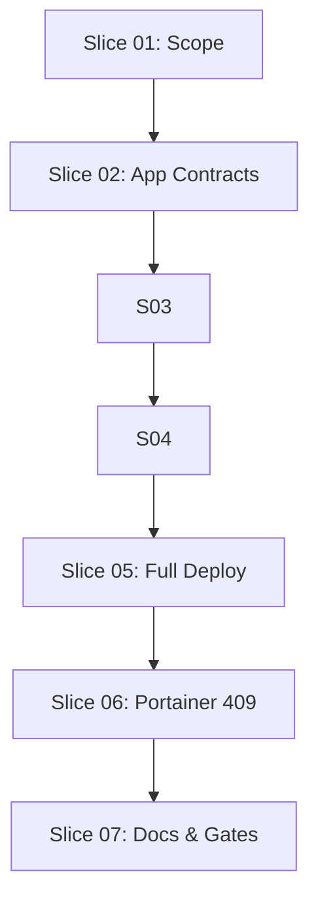

# Workflow: Fresh Install Reset And Full Deploy

```yaml
workflow_id: fresh-install-reset-full-deploy-v1.1.0
workflow_version: 1.1.0
branch: feature/workflow-install-reset-reinstall-20260602
execution_profile: FULL_PATH
released_for_workflow_execute: true
created_utc: "2026-06-02T00:00:00Z"
request: "install.sh soll frisch installieren, vorher resetten, danach vollständig hochfahren und alle Deployments inklusive Service-Access index.html enthalten."
decision: READY_FOR_WORKFLOW
confidence: 95
```

## Executive Summary

`install.sh` currently prepares local secrets and evidence, then runs
`setup run --live`. It does not discard existing LXC-native, Docker Swarm,
Portainer or service-stack state before setup. Existing product architecture
already distinguishes non-destructive `init` and `reconcile` from destructive
`reset` and `destroy`, but destructive execution remains blocked until
retention and teardown semantics are implemented.

This workflow makes the installation wrapper mean fresh installation:
before the canonical live setup run, the current managed local Tiny Swarm World
system is explicitly reset through governed platform boundaries. After reset,
`install.sh` must drive the full guided setup profile through platform,
artifact preparation, deployment apply, deployment verify, and final platform
verification. The Durchstich is complete only when the selected profile
contains all expected deployments, including the service-access stack and its
image-packaged dashboard `index.html`.

Existing update and reconcile mechanisms must remain available for their own
commands unless they block the fresh install path.

## Requirement Clarification Gate

Original request:

* A previous Portainer admin initialization failure showed
  `PortainerAdminInitializationRejected HTTP 409`.
* The first desired step is not an idempotent Portainer-only workaround.
* When `install.sh` is called, the current system should be discarded and
  installed fresh.
* If update mechanisms already exist, keep them unless they block
  reinstallation.
* The workflow must include a reset step.
* The final outcome should be one complete `install.sh` run that brings the
  system up and includes all deployments, including the project's own
  service-access/index page.

Interpreted intent:

* Define and implement a destructive fresh-install prelude for `install.sh`.
* Make that prelude a mandatory reset, not an optional cleanup note.
* Complete the installation Durchstich through all configured setup phases and
  deployments.
* Include service-access dashboard assets, especially
  `infra/compose/service-access/dashboard/index.html`, in acceptance.
* Preserve non-destructive update/reconcile paths.
* Treat Portainer 409 as evidence that persistent prior state must be handled
  by reset or destroy before install, not only by retrying admin bootstrap.

Change type:

* Python automation behavior change.
* Live installation wrapper behavior change.
* Platform destructive workflow implementation.
* Documentation and quality-gate synchronization.

Affected process strand:

* `install.sh` live wrapper.
* `platform reset`.
* `setup run --live`.
* Artifact image preparation.
* Deployment apply and verify.
* Service-access dashboard/index asset path.

Affected architecture area:

* Application platform workflows and ports.
* Infrastructure composition for LXC-native destructive steps.
* Entry-point consent handling.
* Installation documentation and arc42 runtime view.

Explicit requirements:

* `install.sh` means fresh installation.
* `install.sh` must reset the managed local Tiny Swarm World system before
  setup.
* After reset, `install.sh` must run the complete guided setup and deployment
  sequence for the selected profile.
* The default `service-access` profile must include Portainer, Nexus, Jenkins,
  RabbitMQ, SonarQube, Swagger, and service-access deployment contracts.
* The service-access dashboard image must include the committed
  `infra/compose/service-access/dashboard/index.html` file.
* Existing update/reconcile mechanisms stay intact.
* Update/reconcile behavior may be bypassed or constrained only when it blocks
  the fresh installation path.
* Do not run live infrastructure commands while implementing or testing this
  workflow unless explicitly requested.

Implicit requirements:

* Destructive reset must remain consent-gated.
* Reset must use application ports and infrastructure adapters, not direct
  application-layer shell details.
* Reset must be scoped to configured Tiny Swarm World managed nodes and state,
  not all host/provider containers.
* Setup must stop if reset fails.
* Deployment must not be reported complete until required service-access stack
  and readiness evidence are available.
* Tests must use fakes/mocks for LXD, Incus, LXC, Docker Swarm, compose,
  Portainer and service bootstraps.
* Documentation must not claim live success without evidence.
* Generated secrets and local evidence must remain under ignored local state.

Assumptions:

* Fresh install may remove managed provider nodes, Docker/Swarm state,
  Portainer state and deployed service stack state owned by Tiny Swarm World.
* Fresh install must not delete the repository, committed `infra/config`,
  operator-provided external tools, or unrelated host resources.
* The first implementation can target the default `lxc_native` path through
  LXD or Incus.
* "All deploys" means the configured full guided setup profile,
  `service-access`, unless the operator explicitly selects `default`.
* A later update workflow can still use `platform reconcile` or stack
  create/update behavior.

Non-goals:

* No Kubernetes-first behavior.
* No Multipass provider restoration.
* No Java, Maven, Spring Boot, React or browser frontend work.
* No host package installation automation.
* No live reset or live installation run during workflow creation.
* No removal of update/reconcile code solely because fresh install bypasses it.

Risks:

* Destructive scope could be too broad and remove non-project resources.
* Destructive scope could be too narrow and leave Portainer or Swarm state that
  triggers the same 409 failure.
* LXD and Incus teardown commands differ and must be isolated behind adapters.
* A reset-only implementation could pass but still leave artifact or deployment
  gaps; this workflow requires full setup/deployment acceptance.
* Service-access may be blocked by missing external Swarm inputs or image
  publication gaps and must be reported as a blocker rather than success.
* Existing blocked `reset`/`destroy` documentation must be updated only after
  implementation evidence exists.

Open questions:

* Which exact managed resources are in scope for "current system" once the
  provider node names become configurable?
* Whether the reset call is implemented as an internal `platform reset`
  invocation from `install.sh` or through a dedicated setup reinstall service
  is an implementation detail, but the reset behavior is mandatory.

Blocking questions:

* None for workflow authoring. The exact teardown command list is a Slice 01
  design output and must be verified from current provider composition before
  implementation.

Decision:

* `READY_FOR_WORKFLOW`.

## Target Picture

`./install.sh` performs a fresh install by default:

1. loads or generates local secrets;
2. writes evidence context;
3. obtains live consent as today;
4. runs a governed destructive reset of the managed local Tiny Swarm World
   system;
5. refuses to continue if reset is blocked or failed;
6. runs the canonical `setup run --live --service-profile service-access`
   path by default;
7. prepares required artifacts, including service-access dashboard and NGINX
   images;
8. deploys all selected service stacks: Portainer, Nexus, Jenkins, RabbitMQ,
   SonarQube, Swagger and service-access;
9. verifies service readiness evidence, including service-access dashboard,
   Vaultwarden and service-access NGINX services;
10. records reset, setup, artifact and deployment evidence.

Update-style behavior remains available through non-install commands such as
`platform reconcile` and existing deployment stack create/update services.

## Verified Baseline

* Active branch is `feature/workflow-install-reset-reinstall-20260602`.
* `install.sh` calls `PYTHONPATH=src python3 -m tiny_swarm_world setup run --live`
  and does not call `platform reset` or `platform destroy`.
* `PlatformResetWorkflow` and `PlatformDestroyWorkflow` exist and require exact
  confirmation phrases.
* Confirmed reset/destroy currently block when no steps are configured.
* arc42 glossary states reset/destroy are destructive but currently blocked
  until retention or teardown semantics are implemented.
* Portainer admin initialization currently fails fast on typed HTTP rejection
  when requested credentials cannot authenticate.
* The default `install.sh` service profile is `service-access`.
* Service-access dashboard assets exist at
  `infra/compose/service-access/dashboard/index.html`.
* Existing composition already wires artifact targets
  `artifacts:service-access-dashboard-image` and
  `artifacts:service-access-nginx-image`.
* Existing composition already wires deployment targets
  `deployment:service-access-stack`,
  `deployment:service-access-external-input`, and
  `deployment:service-access-service-readiness`.

## Scope

In scope:

* Define fresh-install resource ownership and retention semantics.
* Add LXC-native destructive platform step contracts and adapters.
* Wire reset/destroy steps through composition while keeping confirmation.
* Update `install.sh` to perform the destructive prelude before setup.
* Ensure the install Durchstich executes the complete selected setup profile,
  not only platform bootstrap.
* Verify service-access compose and image assets, including the dashboard
  `index.html`, are part of the default install path.
* Preserve update/reconcile behavior for non-install workflows.
* Add mocked tests and documentation updates.
* Re-check Portainer 409 behavior after reset semantics are in place.

Out of scope:

* Live infrastructure execution in automated tests.
* Production remote cluster lifecycle.
* Kubernetes deployment.
* External static-analysis CI additions.

## Architecture Constraints

* Domain remains independent of application and infrastructure.
* Application services depend on ports, not concrete LXC, Docker or shell
  commands.
* LXD/Incus, Docker and shell details stay in infrastructure adapters.
* Standard runtime wiring remains in
  `src/tiny_swarm_world/infrastructure/composition.py`.
* `src/tiny_swarm_world/__main__.py` remains thin.
* Destructive commands require `--live`, short interactive live consent and the
  exact destructive confirmation phrase.
* No live `incus`, `lxc`, `docker swarm`, compose, netplan, socat or service
  bootstrap command may run during tests.

## Python Automation Assessment

Primary work is Python automation. Implement with typed ports, small services,
deterministic fakes and existing platform workflow result contracts.

## Frontend Assessment

No browser frontend or React work is involved. Console/status UI impact is
limited to existing terminal status vocabulary for reset/setup progress.

## Test Strategy

Run targeted tests first:

```bash
PYTHONPATH=src python3 -m unittest tests.application.services.platform.test_platform_workflows
PYTHONPATH=src python3 -m unittest tests.test_package_entrypoint
PYTHONPATH=src python3 -m unittest tests.infrastructure.test_composition
PYTHONPATH=src python3 -m unittest tests.application.services.deployment.test_ensure_portainer_admin_access
PYTHONPATH=src python3 -m unittest tests.infrastructure.adapters.clients.test_lxc_swarm_runtime
PYTHONPATH=src python3 -m unittest tests.domain.deployment.test_service_stack_contract
PYTHONPATH=src python3 -m unittest tests.application.services.deployment.test_service_stack_plan
PYTHONPATH=src python3 -m unittest tests.application.services.deployment.test_verify_swarm_service_readiness
PYTHONPATH=src python3 -m unittest tests.infrastructure.adapters.repositories.test_compose_file_repository_yaml
```

Required gate before commit or push when practical:

```bash
python3 tools/quality_gate.py quality
```

Documentation-only checkpoints may use:

```bash
git diff --check
```

## Resilience Requirements

* Reset is idempotent for already-missing managed resources.
* Reset evidence records sanitized target IDs and statuses only.
* Partial reset failures stop before setup starts.
* Setup does not run after destructive reset failure.
* Artifact or deployment failures stop before reporting install success.
* Service-access external-input or readiness blockers are surfaced explicitly.
* Portainer 409 after reset is treated as a blocker requiring evidence review,
  not hidden by repeated initialization attempts.

## Ordered Slices

### Slice 01: Define Fresh-Install Destructive Scope

Purpose:

Define exactly what `install.sh` may discard before setup and how reset differs
from update/reconcile. Confirm that the Durchstich target includes the full
default `service-access` profile.

```yaml
slice_id: "01"
profile: FULL_PATH
owner: Senior System Architect
secondary_reviewers:
  - Senior Requirement Engineer
  - Senior DevOps Engineer
affected_files:
  - documentation/arc42/02_constraints.adoc
  - documentation/arc42/06_runtime_view.adoc
  - documentation/arc42/12_glossary.adoc
  - documentation/system/live-operation-surfaces.adoc
  - documentation/user_guide/installation.adoc
affected_modules:
  - platform
affected_contracts:
  - platform reset
  - platform destroy
dependencies: []
parallel_group: A
file_locks:
  - documentation/arc42/02_constraints.adoc
  - documentation/arc42/06_runtime_view.adoc
  - documentation/arc42/12_glossary.adoc
  - documentation/system/live-operation-surfaces.adoc
  - documentation/user_guide/installation.adoc
contract_locks:
  - destructive-platform-semantics
architecture_locks:
  - hexagonal-platform-boundary
quality_gates:
  targeted:
    - git diff --check
  required:
    - python3 tools/quality_gate.py quality
documentation:
  arc42: update runtime/glossary only after source semantics are clear
  adr: decide whether reset semantics require ADR update
stop_conditions:
  - destructive scope would require guessing non-project resource ownership
  - reset behavior conflicts with existing safety ADR
```

Done criteria:

* Fresh install ownership boundary is documented.
* Update/reconcile preservation is explicit.
* The workflow explicitly chooses reset as mandatory first install action.
* The full-deploy target includes service-access dashboard/index acceptance.
* Destructive reset confirmation remains mandatory.

### Slice 02: Implement Reset/Destroy Step Contracts

Purpose:

Add application-level step contracts for destructive managed-system reset and
verify-after-reset evidence.

```yaml
slice_id: "02"
profile: FULL_PATH
owner: Senior Python Automation Developer
secondary_reviewers:
  - Senior System Architect
  - Senior Tester
affected_files:
  - src/tiny_swarm_world/application/ports
  - src/tiny_swarm_world/application/services/platform
  - tests/application/services/platform
affected_modules:
  - tiny_swarm_world.application
affected_contracts:
  - PlatformResetWorkflow
  - PlatformDestroyWorkflow
dependencies:
  - "01"
parallel_group: B
file_locks:
  - src/tiny_swarm_world/application/ports
  - src/tiny_swarm_world/application/services/platform
  - tests/application/services/platform
contract_locks:
  - platform-reset-result-contract
architecture_locks:
  - application-depends-on-ports
quality_gates:
  targeted:
    - PYTHONPATH=src python3 -m unittest tests.application.services.platform.test_platform_workflows
  required:
    - python3 tools/quality_gate.py quality
documentation:
  arc42: pending Slice 05
  adr: pending Slice 01 decision
stop_conditions:
  - application service needs concrete LXC/Docker shell details
  - reset cannot produce safe verification evidence
```

Done criteria:

* Confirmed reset/destroy can execute configured steps.
* Missing confirmation refuses before mutation.
* Missing or failed verification blocks or fails before setup.
* Tests use fakes only.

### Slice 03: Add LXC-Native Destructive Infrastructure Adapter

Purpose:

Implement the LXD/Incus managed-resource teardown adapter behind the new port.
The adapter must delete only configured or marker-verified Tiny Swarm World
managed containers; it must not implement a broad "delete all LXC containers"
host operation.

```yaml
slice_id: "03"
profile: FULL_PATH
owner: Senior DevOps Engineer
secondary_reviewers:
  - Senior Python Automation Developer
  - Senior Tester
affected_files:
  - src/tiny_swarm_world/infrastructure/adapters/clients
  - src/tiny_swarm_world/infrastructure/composition.py
  - tests/infrastructure
affected_modules:
  - tiny_swarm_world.infrastructure
affected_contracts:
  - lxc_native reset adapter
dependencies:
  - "02"
parallel_group: C
file_locks:
  - src/tiny_swarm_world/infrastructure/adapters/clients
  - src/tiny_swarm_world/infrastructure/composition.py
  - tests/infrastructure
contract_locks:
  - lxc-native-managed-resource-teardown
architecture_locks:
  - infrastructure-implements-ports
quality_gates:
  targeted:
    - PYTHONPATH=src python3 -m unittest tests.infrastructure.test_composition
  required:
    - python3 tools/quality_gate.py quality
documentation:
  arc42: pending Slice 05
  adr: pending Slice 01 decision
stop_conditions:
  - adapter would need to delete resources not provably owned by Tiny Swarm World
  - implementation needs live provider commands in tests
```

Done criteria:

* Adapter commands are deterministic and scoped to managed node names/state.
* Adapter never deletes unmarked, unknown, or non-configured containers.
* Already-missing resources are treated as successful reset evidence.
* Composition wires reset/destroy steps only for supported provider selection.

### Slice 04: Make install.sh Fresh-Install By Default

Purpose:

Call the governed destructive reset prelude from `install.sh` before
`setup run --live`, then require the full selected setup profile to complete
before reporting installation success.

```yaml
slice_id: "04"
profile: FULL_PATH
owner: Senior Python Automation Developer
secondary_reviewers:
  - Senior DevOps Engineer
  - Senior Tester
affected_files:
  - install.sh
  - tests
  - documentation/user_guide/installation.adoc
affected_modules:
  - installation wrapper
affected_contracts:
  - install.sh fresh-install contract
dependencies:
  - "03"
parallel_group: D
file_locks:
  - install.sh
  - tests
  - documentation/user_guide/installation.adoc
contract_locks:
  - install-wrapper-live-contract
architecture_locks:
  - live-consent-contract
quality_gates:
  targeted:
    - bash -n install.sh
    - PYTHONPATH=src python3 -m unittest tests.test_package_entrypoint
  required:
    - python3 tools/quality_gate.py quality
documentation:
  arc42: pending Slice 05
  adr: pending Slice 01 decision
stop_conditions:
  - install.sh would bypass live consent or destructive confirmation
  - setup can run after reset failure
```

Done criteria:

* `install.sh` records reset and setup evidence.
* Setup starts only after successful reset.
* Install exits non-zero when reset is blocked or failed.
* Existing non-install update/reconcile commands remain reachable.
* Shell parsing validates with `bash -n install.sh`.

### Slice 05: Complete Full Deployment Durchstich

Purpose:

Ensure the post-reset `install.sh` path drives the complete guided setup:
artifact preparation, stack deployment, service readiness checks, and
service-access dashboard/index inclusion.

```yaml
slice_id: "05"
profile: FULL_PATH
owner: Senior Python Automation Developer
secondary_reviewers:
  - Senior Tester
  - Senior DevOps Engineer
  - Senior System Architect
affected_files:
  - src/tiny_swarm_world/infrastructure/composition.py
  - src/tiny_swarm_world/domain/artifacts/container_image_contract.py
  - src/tiny_swarm_world/domain/deployment/service_stack_contract.py
  - infra/config/compose/service-access/docker-compose.yml
  - infra/compose/service-access/dashboard/Dockerfile
  - infra/compose/service-access/dashboard/index.html
  - infra/compose/service-access/nginx/Dockerfile
  - infra/compose/service-access/nginx/default.conf
  - tests/infrastructure/test_composition.py
  - tests/domain/deployment/test_service_stack_contract.py
  - tests/application/services/deployment/test_service_stack_plan.py
  - tests/application/services/deployment/test_verify_swarm_service_readiness.py
  - tests/infrastructure/adapters/repositories/test_compose_file_repository_yaml.py
affected_modules:
  - tiny_swarm_world.domain.artifacts
  - tiny_swarm_world.domain.deployment
  - tiny_swarm_world.infrastructure
  - service-access assets
affected_contracts:
  - full guided setup profile
  - service-access stack
  - service-access dashboard image
  - service-access nginx image
dependencies:
  - "04"
parallel_group: E
file_locks:
  - src/tiny_swarm_world/infrastructure/composition.py
  - src/tiny_swarm_world/domain/artifacts/container_image_contract.py
  - src/tiny_swarm_world/domain/deployment/service_stack_contract.py
  - infra/config/compose/service-access/docker-compose.yml
  - infra/compose/service-access/dashboard/Dockerfile
  - infra/compose/service-access/dashboard/index.html
  - infra/compose/service-access/nginx/Dockerfile
  - infra/compose/service-access/nginx/default.conf
  - tests/infrastructure/test_composition.py
  - tests/domain/deployment/test_service_stack_contract.py
  - tests/application/services/deployment/test_service_stack_plan.py
  - tests/application/services/deployment/test_verify_swarm_service_readiness.py
  - tests/infrastructure/adapters/repositories/test_compose_file_repository_yaml.py
contract_locks:
  - service-access-deployment-contract
  - install-full-deploy-contract
architecture_locks:
  - deployment-profile-boundary
quality_gates:
  targeted:
    - PYTHONPATH=src python3 -m unittest tests.infrastructure.test_composition
    - PYTHONPATH=src python3 -m unittest tests.domain.deployment.test_service_stack_contract
    - PYTHONPATH=src python3 -m unittest tests.application.services.deployment.test_service_stack_plan
    - PYTHONPATH=src python3 -m unittest tests.application.services.deployment.test_verify_swarm_service_readiness
    - PYTHONPATH=src python3 -m unittest tests.infrastructure.adapters.repositories.test_compose_file_repository_yaml
  required:
    - python3 tools/quality_gate.py quality
documentation:
  arc42: update deployment/runtime view after evidence
  adr: none expected unless changing service-access ownership
stop_conditions:
  - default setup path omits service-access after reset
  - service-access dashboard index is no longer image-packaged
  - deployment readiness is inferred without observed evidence
```

Done criteria:

* The default install profile includes all expected stacks.
* Service-access dashboard and NGINX images are part of artifact preparation.
* The dashboard Dockerfile copies `index.html` into the image.
* Deployment apply includes `deployment:service-access-stack`.
* Deployment verify includes `deployment:service-access-service-readiness`.
* Install success cannot be reported when any selected artifact, stack, or
  readiness target is blocked or failed.

### Slice 06: Reconcile Portainer Admin 409 Behavior

Purpose:

Verify whether fresh reset removes the Portainer 409 failure. Keep or adjust
Portainer admin idempotency only if needed after reset semantics.

```yaml
slice_id: "06"
profile: FULL_PATH
owner: Senior Tester
secondary_reviewers:
  - Senior Python Automation Developer
  - Senior System Architect
affected_files:
  - src/tiny_swarm_world/application/services/deployment/ensure_portainer_admin_access.py
  - src/tiny_swarm_world/application/ports/clients/port_portainer_admin_client.py
  - src/tiny_swarm_world/infrastructure/adapters/clients/lxc_swarm_runtime.py
  - tests/application/services/deployment/test_ensure_portainer_admin_access.py
  - tests/infrastructure/adapters/clients/test_lxc_swarm_runtime.py
affected_modules:
  - tiny_swarm_world.application.services.deployment
  - tiny_swarm_world.infrastructure.adapters.clients
affected_contracts:
  - Portainer admin bootstrap
dependencies:
  - "05"
parallel_group: F
file_locks:
  - src/tiny_swarm_world/application/services/deployment/ensure_portainer_admin_access.py
  - src/tiny_swarm_world/application/ports/clients/port_portainer_admin_client.py
  - src/tiny_swarm_world/infrastructure/adapters/clients/lxc_swarm_runtime.py
  - tests/application/services/deployment/test_ensure_portainer_admin_access.py
  - tests/infrastructure/adapters/clients/test_lxc_swarm_runtime.py
contract_locks:
  - portainer-admin-bootstrap
architecture_locks:
  - deployment-client-port-boundary
quality_gates:
  targeted:
    - PYTHONPATH=src python3 -m unittest tests.application.services.deployment.test_ensure_portainer_admin_access
    - PYTHONPATH=src python3 -m unittest tests.infrastructure.adapters.clients.test_lxc_swarm_runtime
  required:
    - python3 tools/quality_gate.py quality
documentation:
  arc42: update rejection-gate wording if behavior changes
  adr: none expected unless changing safety contract
stop_conditions:
  - idempotency would hide wrong configured credentials
  - Portainer API probing requires live network calls in unit tests
```

Done criteria:

* If reset fully removes prior Portainer state, existing fail-fast rejection can
  remain.
* If retained Portainer state is intentionally supported, admin initialization
  adds a safe initialized-state check or 409-as-success path only when the goal
  is already achieved.
* No credential payloads appear in logs or evidence.

### Slice 07: Documentation And Quality Closure

Purpose:

Synchronize user docs, arc42, live-operation surfaces, workflow evidence and
quality gates.

```yaml
slice_id: "07"
profile: FULL_PATH
owner: Senior Documentation Engineer
secondary_reviewers:
  - Senior Tester
  - Senior System Architect
affected_files:
  - documentation/user_guide/installation.adoc
  - documentation/user_guide/troubleshooting.adoc
  - documentation/system/live-operation-surfaces.adoc
  - documentation/arc42/**
  - documentation/workflow/**
affected_modules:
  - documentation
affected_contracts:
  - install fresh-install operator contract
dependencies:
  - "06"
parallel_group: G
file_locks:
  - documentation/user_guide/installation.adoc
  - documentation/user_guide/troubleshooting.adoc
  - documentation/system/live-operation-surfaces.adoc
  - documentation/arc42/**
  - documentation/workflow/**
contract_locks:
  - documentation-runtime-alignment
architecture_locks:
  - arc42-current-behavior-only
quality_gates:
  targeted:
    - git diff --check
  required:
    - python3 tools/quality_gate.py quality
documentation:
  arc42: required
  adr: required only if Slice 01 identifies a new decision
stop_conditions:
  - docs claim live end-to-end success without evidence
  - docs describe planned reset behavior as implemented before code lands
```

Done criteria:

* Installation guide says `install.sh` performs fresh install once implemented.
* Installation guide states that default fresh install uses the `service-access`
  profile and includes the service-access dashboard/index path.
* Troubleshooting explains Portainer 409 as stale state or credential mismatch.
* arc42 reflects actual implemented reset behavior.
* Workflow execution report records commands and results.

## Slice Dependency Graph



## Parallelization Opportunities

* Execution is intentionally serial for this workflow because destructive
  reset semantics, application contracts, LXC-native adapter behavior,
  `install.sh`, deployment acceptance and final documentation all depend on
  prior slice evidence.
* Slice 01 must happen first.
* Slice 02 follows Slice 01.
* Slice 03 follows Slice 02 because the infrastructure adapter must implement
  the accepted application port/contract.
* Slice 04 follows Slices 02 and 03.
* Slice 05 follows Slice 04.
* Slice 06 follows Slice 05.
* Slice 07 closes after implementation and test evidence.

## Ownership Map

* Senior Requirement Engineer: requirement drift, non-goals, acceptance.
* Senior System Architect: destructive boundary and ADR decision.
* Senior Python Automation Developer: application services, wrapper behavior.
* Senior Tester: fake-based regression suite and quality-gate evidence.
* Senior DevOps Engineer: LXD/Incus/Docker Swarm command safety review.
* Senior Documentation Engineer: documentation and workflow consistency.
* Frontend assessment: no browser or React execution route; use console/status
  UI skills only if terminal progress vocabulary changes.
* Console/status UI skills: terminal status only if reset progress vocabulary
  changes.

## Documentation Synchronization Points

* After Slice 01: document planned destructive scope without claiming
  implementation.
* After Slice 04: update installation guide to describe actual fresh-install
  behavior.
* After Slice 05: document full setup/deployment Durchstich and service-access
  dashboard/index inclusion.
* After Slice 06: update Portainer troubleshooting and arc42 quality wording.

## Stop Conditions

Stop workflow execution when:

* live infrastructure commands would be required without explicit approval;
* destructive ownership cannot be verified from repository configuration;
* reset would remove unrelated host/provider resources;
* update/reconcile code would need removal without a blocker;
* `install.sh` could finish without selected profile deployments;
* service-access dashboard/index assets are not included in the deployment
  contract;
* architecture would require application services to run raw shell commands;
* documentation would need to claim behavior before implementation evidence.

## Uncertainty Escalation

Escalate to the Root Architect when reset scope, retention semantics, ADR need,
or ownership of provider resources cannot be determined from repository
evidence.

## Commit And Push Plan

* Commit workflow artifacts separately from implementation if requested.
* The current user request explicitly includes `push && workflow execute`.
* During execution, commit slices in dependency order after targeted tests pass.
* Push each successful slice checkpoint to
  `origin/feature/workflow-install-reset-reinstall-20260602`.
* Do not create or merge a pull request unless explicitly requested.

## Definition Of Done

* `install.sh` performs a consent-gated destructive reset before setup.
* Reset is scoped to Tiny Swarm World managed local resources.
* Existing update/reconcile paths remain available unless proven blockers.
* `install.sh` completes the full selected setup profile after reset.
* Default install includes Portainer, Nexus, Jenkins, RabbitMQ, SonarQube,
  Swagger, and service-access deployment contracts.
* Service-access dashboard `index.html` is image-packaged and included in the
  install acceptance path.
* Install success is impossible while any selected artifact, deployment, or
  readiness check is blocked or failed.
* Portainer 409 is either eliminated by reset or handled with explicit safe
  semantics.
* Tests cover success, refused consent, reset failure, already-missing
  resources and setup-not-run-after-reset-failure.
* Required quality gates are executed or skips are documented.
* arc42 and user documentation match implemented behavior.

## Handoff To workflow execute

Before execution:

* verify active branch is `feature/workflow-install-reset-reinstall-20260602`;
* verify this workflow and context pack are current;
* run Slice 01 before write-capable implementation;
* keep live infrastructure commands out of tests.

## arc42 Check Status

arc42 has been checked during workflow creation. A small synchronization note
was added to the runtime view to record the planned fresh-install reset target.
Full arc42 behavior updates occur in Slice 07 after Slice 06 evidence.
