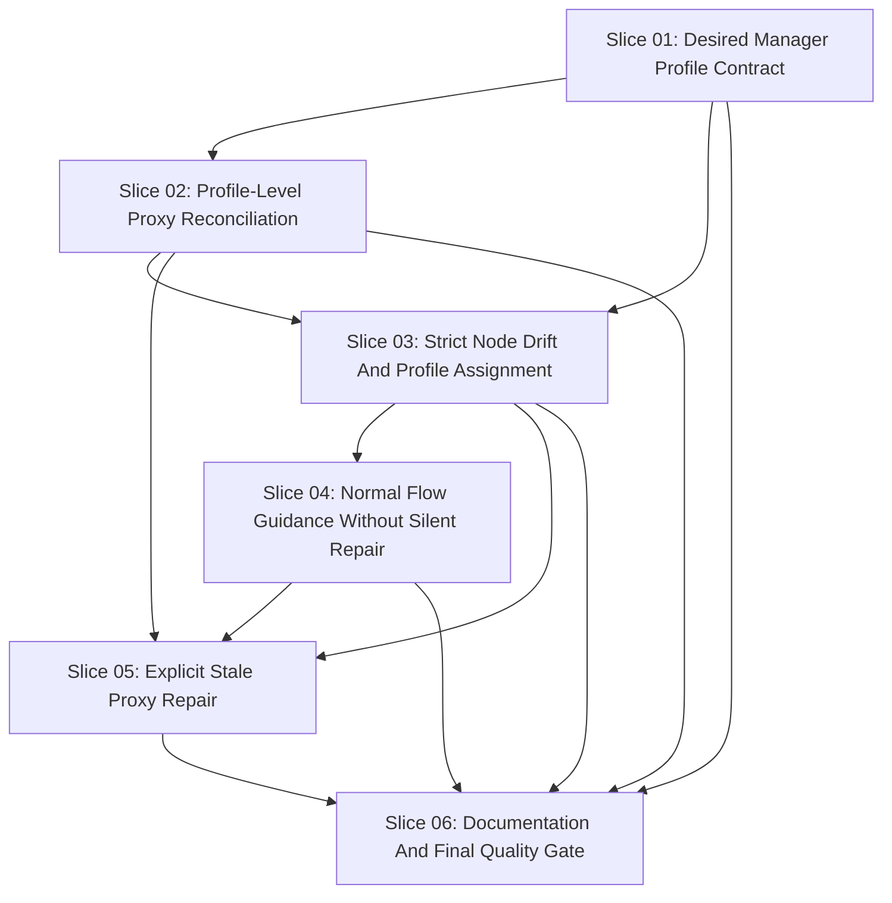

# Workflow: LXC Proxy Drift Reconciliation

```yaml
workflow_id: lxc-proxy-drift-reconciliation-v1.0.0
workflow_version: 1.0.0
branch: fix/lxc-proxy-drift-reconciliation-20260606
execution_profile: FULL_PATH
released_for_workflow_execute: true
created_utc: "2026-06-06T00:00:00Z"
request: "Fix the current LXC proxy drift problem without bypassing unsafe_instance_devices."
decision: READY_FOR_WORKFLOW
confidence: 94
```

## Executive Summary

The current install/reset/reinstall path can stop with
`unsafe_instance_devices` when `swarm-manager` has direct instance-level
`tsw-proxy-*` devices. That stop is correct and must remain strict.

Repository inspection found two important facts:

* `src/tiny_swarm_world/infrastructure/adapters/clients/lxc_proxy_device_runtime.py`
  creates and updates proxy devices with direct instance commands such as
  `config device add <instance> <device> proxy`.
* `src/tiny_swarm_world/infrastructure/adapters/clients/lxc_node_provider.py`
  currently has a special `allow_project_proxy_devices=True` path that can
  classify direct instance-level `tsw-proxy-*` devices as safe during node
  lifecycle checks.

This workflow repairs the desired-state model instead of weakening drift
detection. Manager proxy devices must be represented as expected profile-level
state in a manager-specific LXC profile. Normal install, reset, reinstall,
init, reconcile, and expose flows must not silently remove stale direct
devices or create new direct `tsw-proxy-*` devices. Stale direct proxy devices
may be removed only through an explicit repair workflow after equivalent
manager-profile devices are verified.

The previous active workflow under `documentation/workflow` is superseded by
this workflow for the active workflow directory.

## Requirement Clarification Gate

Original request:

* Fix the current `unsafe_instance_devices` failure caused by direct
  `tsw-proxy-*` LXC proxy devices on `swarm-manager`.
* Do not introduce a new provisioning tool, Ansible, Java, Maven, Spring Boot,
  or a CLI redesign.
* Preserve the hard stop for unexpected direct instance-level devices.
* Move proxy devices into expected desired state, preferably using existing
  YAML/config/profile mechanisms.
* Use a manager-specific profile so workers do not receive manager-only proxy
  devices.
* Add explicit stale-state repair for direct instance-level `tsw-proxy-*`
  devices only when equivalent expected profile devices exist.
* Keep `install.sh` thin and keep actual logic in Python.
* Add tests and documentation for the profile-vs-instance distinction,
  manager-only profile assignment, strict drift detection, and repair behavior.

Interpreted intent:

* Create an executable workflow for a focused Python automation bug fix in the
  LXC-native platform boundary.
* Preserve hexagonal architecture: domain value objects describe desired state,
  application services orchestrate ports, infrastructure adapters run LXC or
  Incus commands, and composition wires concrete adapters.
* Treat live LXC/Incus/LXD mutation as out of scope for workflow creation and
  unit tests.

Change type:

* Python automation behavior change.
* LXC-native desired-state/configuration model change.
* Infrastructure adapter command behavior change.
* Platform workflow and CLI surface change for explicit repair.
* Documentation and arc42 synchronization.

Affected process strand:

* `install.sh` launcher flow.
* `setup run --live` platform phase.
* `platform init`, `platform reconcile`, `platform expose`, `platform reset`,
  and the new explicit repair path.
* LXC-native node lifecycle, profile reconciliation, and drift detection.

Affected architecture area:

* `infra/config/node-providers/provider_config.yaml`.
* `src/tiny_swarm_world/domain/network`.
* `src/tiny_swarm_world/application/ports/node_provider`.
* `src/tiny_swarm_world/application/services/platform`.
* `src/tiny_swarm_world/infrastructure/adapters/clients`.
* `src/tiny_swarm_world/infrastructure/adapters/repositories`.
* `src/tiny_swarm_world/infrastructure/composition.py`.
* `src/tiny_swarm_world/__main__.py`.
* Platform, infrastructure, CLI, and architecture documentation.

Explicit requirements:

* Normal flows must not add direct instance-level `tsw-proxy-*` devices.
* Direct instance-level `tsw-proxy-*` devices must remain
  `unsafe_instance_devices`.
* Expected proxy devices must be declared and reconciled as manager-specific
  profile-level state.
* The manager node must have both the common Docker Swarm/base profile and a
  manager-only proxy profile.
* Worker nodes must not have the manager-specific proxy profile or
  `tsw-proxy-*` devices.
* Repair must remove only stale direct `tsw-proxy-*` devices that have
  equivalent expected manager-profile devices.
* Repair must refuse when equivalent profile state is missing.
* Documentation must explain profile-level devices, direct instance devices,
  drift classification, manager-only ownership, worker exclusion, and repair.

Implicit requirements:

* No direct LXC, Incus, Docker, filesystem, curses, logging, YAML parser, or UI
  adapter imports in domain modules.
* No low-level command execution inside application services.
* No live infrastructure commands during workflow creation or default tests.
* No host-specific IPs, usernames, paths, raw command output, or secrets in
  committed configuration or evidence.
* Existing safety behavior for unrelated unexpected devices remains unchanged.
* `install.sh` remains a Python launcher and does not gain business logic.

Assumptions:

* No existing explicit LXC proxy repair command was found, so workflow
  execution may introduce a narrow `platform repair-lxc-proxy-drift` workflow
  action or an equivalently explicit platform repair action.
* The current setup manifest remains the source for published service ports.
  The manager-specific profile desired state can be generated from that manifest
  while the profile name and node profile assignment are declared in provider
  configuration.
* Profile mutation requires live consent and must be covered by mocked tests.
* A small schema extension for ordered node profiles is acceptable because the
  current single `profile` field cannot model common plus manager-specific
  profile assignment.

Non-goals:

* No new provisioning system.
* No Ansible, Terraform, Kubernetes-first behavior, Multipass restoration,
  Java, Maven, Spring Boot, React, or browser frontend scope.
* No broad CLI redesign.
* No deletion of unrelated instances, profiles, networks, or devices.
* No automatic repair inside normal install, reset, reinstall, init,
  reconcile, or expose flows.
* No weakening of `unsafe_instance_devices`.
* No worker-node exposure of manager host proxy ports.
* No live `incus`, `lxc`, `docker swarm`, compose, service bootstrap, or
  network mutation during workflow creation.

Risks:

* Current tests include behavior that allows project proxy devices during reset;
  those tests must be changed deliberately.
* Adding multiple profile assignment changes the node-provider config contract
  and launch command shape.
* Profile-device command syntax differs by target type: instance commands use
  `config device ...`, while profile commands use `profile device ...`.
* The provider config safety validator currently rejects unknown profile
  fields and any profile device output; it must allow only the explicitly
  expected manager profile devices.
* A repair command that removes devices without equivalence checks would create
  a safety regression.

Open questions:

* None blocking for workflow execution.
* During Slice 01, choose the exact schema shape for ordered node profiles:
  `profiles: [...]` or `profile` plus `additional_profiles`. Prefer the
  smallest backward-compatible shape that keeps tests deterministic.
* During Slice 05, choose the exact CLI action name if
  `platform repair-lxc-proxy-drift` conflicts with current taxonomy naming.

Blocking questions:

* None.

Decision:

* `READY_FOR_WORKFLOW`.

## Execution Profile

```text
executionProfile=FULL_PATH
reason=LXC-native runtime behavior, profile desired state, drift detection, explicit repair, tests, CLI taxonomy, and architecture documentation are affected.
requiredFullReviews=Senior Requirement Engineer, Senior System Architect, Senior Python Automation Developer, Senior React Frontend Developer, Senior Tester
allowedImpactChecks=Senior React Frontend Developer may record no browser/React impact after verifying no browser frontend files are touched.
requiredQualityChecks=targeted unittest commands first; git diff --check for workflow/docs; python3 tools/quality_gate.py quality before commit or push when practical.
stopConditions=direct instance proxy creation remains in normal flow, unsafe_instance_devices is weakened, repair lacks profile equivalence, worker receives manager proxy profile, live infrastructure command required without explicit approval.
```

## Five-Role Three Amigos Findings

Senior Requirement Engineer:

* The implementation still matches
  `documentation/epics/autonomous-runnable-setup.md` because it preserves the
  LXC-native provider direction, live-consent model, setup orchestration, and
  fail-closed behavior.
* The required acceptance criteria are testable and map directly to source,
  tests, and documentation updates.
* The current active workflow is replaced, not extended, because this request
  targets a different failure class than the previous Portainer endpoint
  workflow.

Senior System Architect:

* Expected proxy ownership belongs to the LXC-native platform boundary.
* Domain code may describe proxy plans and desired profile state, but concrete
  LXC/Incus command execution belongs in infrastructure adapters.
* Application services may orchestrate profile reconciliation and repair ports
  but must not embed command strings or YAML parsing details.
* Manager-specific profile state must not be placed in the shared
  `docker-swarm` profile if workers also receive that profile.

Senior Python Automation Developer:

* Current direct proxy injection is in `LxcProxyDeviceRuntime`.
* Current platform expose orchestration is in `LxcServiceExposureService`.
* Current node lifecycle strictness is in `_ObservedNode.mismatch_reasons` and
  `_has_unsafe_instance_devices`.
* The provider config repository must be extended carefully because it rejects
  unknown fields and unsafe committed values by design.

Senior React Frontend Developer:

* No browser or React frontend impact was found. Tiny Swarm World console/status
  UI guidance remains terminal-only.
* CLI output and documentation must avoid decorative icons and keep operator
  repair guidance concise.

Senior Tester:

* Tests must cover clean profile-level state, direct instance drift, worker
  exclusion, no direct injection, guarded repair success, guarded repair
  refusal, and unrelated-device safety.
* Live infrastructure tests are not required by the default gate. LXC/Incus
  command execution must be mocked.

Dependency / Deadlock Validator:

* Slice dependencies are acyclic.
* Config/profile model changes must happen before direct injection is removed.
* Repair depends on profile equivalence checks and strict instance drift
  classification.
* Documentation should wait until the implementation behavior is known.

## Verified Baseline

Repository and branch:

* Repository root verified at `/mnt/d/Projects/Tiny-Swarm-World`.
* Branch created and verified:
  `fix/lxc-proxy-drift-reconciliation-20260606`.
* Branch ref check succeeded with
  `git show-ref --verify --quiet refs/heads/fix/lxc-proxy-drift-reconciliation-20260606`.
* Active branch check returned
  `fix/lxc-proxy-drift-reconciliation-20260606`.

Relevant current behavior:

* `LxcProxyDeviceRuntime.create_proxy_device` calls
  `<backend> config device add <node> <device> proxy ...`, which targets direct
  instance-level devices.
* `LxcProxyDeviceRuntime.update_proxy_device` calls
  `<backend> config device set <node> <device> ...`, which also targets direct
  instance-level devices.
* `LxcServiceExposureService` applies proxy plans to `gateway_node`, currently
  `swarm-manager`.
* `_ObservedNode.mismatch_reasons` calls
  `_has_unsafe_instance_devices(self.devices, allow_project_proxy_devices=True)`.
* `tests/infrastructure/adapters/clients/test_lxc_node_provider.py` currently
  includes a reset test that allows project proxy devices before deleting the
  node.
* `infra/config/node-providers/provider_config.yaml` currently assigns a
  single `docker-swarm` profile to manager and worker nodes.
* No dedicated LXC proxy drift repair command was found in the CLI taxonomy.

## Target Picture

The target state is:

* `swarm-manager` has ordered profiles that include the common Docker Swarm
  profile and a manager-specific proxy profile.
* Worker nodes have only the common worker-safe profile set and never receive
  manager proxy devices.
* Expected `tsw-proxy-*` devices live in the manager-specific profile desired
  state and are reconciled through profile commands, not direct instance
  commands.
* `lxc config device show <instance>` or `incus config device show <instance>`
  output remains strict direct instance drift evidence.
* Normal install/reset/reinstall/init/reconcile/expose stops on direct
  `tsw-proxy-*` instance drift and prints a clear repair command.
* The explicit repair command removes only matching stale direct proxy devices
  after equivalent manager-profile devices are verified.

## Architecture Constraints

* Preserve hexagonal architecture.
* Domain modules may contain typed value objects and validation only.
* Application services depend on ports and domain objects.
* Infrastructure adapters run `incus` or `lxc` commands and parse command
  output.
* Standard runtime wiring remains in
  `src/tiny_swarm_world/infrastructure/composition.py`.
* Entry-point changes in `src/tiny_swarm_world/__main__.py` remain thin CLI
  taxonomy and dispatch changes.
* Provider YAML remains product behavior and must be parsed through structured
  YAML APIs.

## Python Automation Assessment

Expected implementation areas:

* Extend node-provider config to express ordered profiles or common plus
  additional profile assignment.
* Add profile-level desired proxy device state using existing setup manifest
  port plans and manager profile configuration.
* Replace direct instance proxy mutation with profile reconciliation.
* Remove the normal-flow special allowance for direct project proxy devices.
* Add explicit repair orchestration with equivalence checks.
* Keep evidence summary-only and redacted.

## Frontend Assessment

No React, browser frontend, JavaScript build, TSX/JSX, or browser state is in
scope. Console/status UI and CLI messages may be updated only as needed for
clear repair guidance.

## Test Strategy

Default tests use mocks and fake runners. No live LXD, Incus, LXC, Docker
Swarm, compose, or service bootstrap commands are required.

Targeted commands:

```bash
PYTHONPATH=src python3 -m unittest tests.infrastructure.adapters.repositories.test_node_provider_config_yaml_repository
PYTHONPATH=src python3 -m unittest tests.infrastructure.adapters.clients.test_lxc_node_provider
PYTHONPATH=src python3 -m unittest tests.infrastructure.adapters.clients.test_lxc_proxy_device_runtime
PYTHONPATH=src python3 -m unittest tests.application.services.platform.test_lxc_service_exposure tests.application.services.platform.test_platform_workflows
PYTHONPATH=src python3 -m unittest tests.test_package_entrypoint tests.test_install_script
git diff --check
```

Required before commit or push when practical:

```bash
python3 tools/quality_gate.py quality
```

## Resilience Requirements

* Repair must be idempotent: rerunning after stale direct devices are removed
  should verify no stale devices remain.
* Missing manager profile devices must block repair rather than remove stale
  direct devices.
* Unknown device shapes must remain blocked as unsafe.
* Profile reconciliation failures must report summary counts and classifications
  without raw command output.
* Normal flows must fail closed and guide the operator to explicit repair.

## Ordered Slices

### Slice 01: Desired Manager Profile Contract

Purpose:

Define the desired-state model that lets `swarm-manager` receive a common
Docker Swarm profile plus a manager-specific proxy profile while workers remain
on the common profile only.

```yaml
slice_id: "01"
profile: FULL_PATH
owner: Senior Python Automation Developer
secondary_reviewers:
  - Senior Requirement Engineer
  - Senior System Architect
  - Senior Tester
affected_files:
  - infra/config/node-providers/provider_config.yaml
  - src/tiny_swarm_world/infrastructure/adapters/repositories/node_provider_config_yaml_repository.py
  - tests/infrastructure/adapters/repositories/test_node_provider_config_yaml_repository.py
affected_modules:
  - tiny_swarm_world.infrastructure.adapters.repositories
affected_contracts:
  - node-provider-config
dependencies: []
parallel_group: "A"
file_locks:
  - infra/config/node-providers/provider_config.yaml
  - src/tiny_swarm_world/infrastructure/adapters/repositories/node_provider_config_yaml_repository.py
  - tests/infrastructure/adapters/repositories/test_node_provider_config_yaml_repository.py
contract_locks:
  - node-provider-config-schema
architecture_locks:
  - hexagonal-infrastructure-config-boundary
quality_gates:
  targeted:
    - PYTHONPATH=src python3 -m unittest tests.infrastructure.adapters.repositories.test_node_provider_config_yaml_repository
  required:
    - python3 tools/quality_gate.py quality
documentation:
  arc42: documentation/arc42/07_deployment_view.adoc
  adr: ""
stop_conditions:
  - Config schema would require host-specific values or secrets.
  - Worker node would receive the manager proxy profile.
  - Common docker-swarm profile would receive manager-only proxy devices.
```

Done criteria:

* Provider config can express manager-specific profile assignment.
* `swarm-manager` expected profiles include common plus manager-specific
  profile.
* Workers do not include the manager-specific profile.
* Config repository tests prove the committed YAML loads deterministically and
  rejects unsafe or ambiguous profile state.

### Slice 02: Profile-Level Proxy Reconciliation

Purpose:

Introduce or extend infrastructure profile reconciliation so expected
`tsw-proxy-*` devices are inspected and applied on the manager-specific profile,
not on the `swarm-manager` instance.

```yaml
slice_id: "02"
profile: FULL_PATH
owner: Senior Python Automation Developer
secondary_reviewers:
  - Senior System Architect
  - Senior Tester
affected_files:
  - src/tiny_swarm_world/application/ports/node_provider
  - src/tiny_swarm_world/application/services/platform/lxc_service_exposure.py
  - src/tiny_swarm_world/infrastructure/adapters/clients/lxc_proxy_device_runtime.py
  - src/tiny_swarm_world/infrastructure/composition.py
  - tests/infrastructure/adapters/clients/test_lxc_proxy_device_runtime.py
  - tests/application/services/platform/test_lxc_service_exposure.py
  - tests/infrastructure/test_composition.py
affected_modules:
  - tiny_swarm_world.application.ports.node_provider
  - tiny_swarm_world.application.services.platform
  - tiny_swarm_world.infrastructure.adapters.clients
  - tiny_swarm_world.infrastructure
affected_contracts:
  - lxc-profile-proxy-device-runtime
  - platform-expose
dependencies:
  - "01"
parallel_group: "B"
file_locks:
  - src/tiny_swarm_world/application/ports/node_provider
  - src/tiny_swarm_world/application/services/platform/lxc_service_exposure.py
  - src/tiny_swarm_world/infrastructure/adapters/clients/lxc_proxy_device_runtime.py
  - src/tiny_swarm_world/infrastructure/composition.py
contract_locks:
  - platform-expose-contract
  - lxc-profile-command-contract
architecture_locks:
  - application-depends-on-ports
  - infrastructure-owns-lxc-commands
quality_gates:
  targeted:
    - PYTHONPATH=src python3 -m unittest tests.infrastructure.adapters.clients.test_lxc_proxy_device_runtime
    - PYTHONPATH=src python3 -m unittest tests.application.services.platform.test_lxc_service_exposure
    - PYTHONPATH=src python3 -m unittest tests.infrastructure.test_composition
  required:
    - python3 tools/quality_gate.py quality
documentation:
  arc42: documentation/arc42/06_runtime_view.adoc
  adr: ""
stop_conditions:
  - Profile reconciliation still uses config device add or config device set on an instance.
  - Application service embeds raw lxc or incus command strings.
  - Profile command output is persisted raw.
```

Done criteria:

* Profile device get/add/set or equivalent profile reconciliation is covered by
  fake-runner tests.
* `platform expose` verifies/reconciles profile-level devices.
* No normal expose path calls direct instance `config device add` or direct
  instance `config device set`.
* Existing summary evidence counts remain useful and redacted.

### Slice 03: Strict Node Drift And Profile Assignment

Purpose:

Make node lifecycle checks distinguish expected profile-level devices from
direct instance-level devices and ensure launch/reconciliation uses the expected
ordered profile set.

```yaml
slice_id: "03"
profile: FULL_PATH
owner: Senior Python Automation Developer
secondary_reviewers:
  - Senior System Architect
  - Senior Tester
affected_files:
  - src/tiny_swarm_world/infrastructure/adapters/clients/lxc_node_provider.py
  - tests/infrastructure/adapters/clients/test_lxc_node_provider.py
affected_modules:
  - tiny_swarm_world.infrastructure.adapters.clients
affected_contracts:
  - lxc-node-lifecycle
  - unsafe-instance-device-drift
dependencies:
  - "01"
  - "02"
parallel_group: "C"
file_locks:
  - src/tiny_swarm_world/infrastructure/adapters/clients/lxc_node_provider.py
  - tests/infrastructure/adapters/clients/test_lxc_node_provider.py
contract_locks:
  - node-lifecycle-drift-contract
architecture_locks:
  - infrastructure-owns-provider-command-parsing
quality_gates:
  targeted:
    - PYTHONPATH=src python3 -m unittest tests.infrastructure.adapters.clients.test_lxc_node_provider
  required:
    - python3 tools/quality_gate.py quality
documentation:
  arc42: documentation/arc42/07_deployment_view.adoc
  adr: ""
stop_conditions:
  - Direct instance-level tsw-proxy devices are allowed by normal mismatch detection.
  - Reset or reinstall deletes nodes after unsafe direct proxy drift without explicit repair.
  - Worker launch or existing-node check expects manager proxy profile.
```

Done criteria:

* Direct instance-level `tsw-proxy-*` devices on `swarm-manager` produce
  `unsafe_instance_devices`.
* Unrelated unexpected instance devices remain unsafe.
* Manager launch/check requires the manager profile in addition to the common
  profile.
* Workers require only worker-safe expected profiles.
* Normal reset/reinstall paths do not special-case project proxy devices as
  safe.

### Slice 04: Normal Flow Guidance Without Silent Repair

Purpose:

Ensure install/reset/reinstall/setup/platform flows stop cleanly on stale direct
proxy drift and provide a clear operator repair instruction without performing
repair implicitly.

```yaml
slice_id: "04"
profile: FULL_PATH
owner: Senior Python Automation Developer
secondary_reviewers:
  - Senior Tester
  - Senior Documentation Engineer
affected_files:
  - src/tiny_swarm_world/application/services/platform
  - src/tiny_swarm_world/__main__.py
  - install.sh
  - tests/application/services/platform/test_platform_workflows.py
  - tests/test_package_entrypoint.py
  - tests/test_install_script.py
affected_modules:
  - tiny_swarm_world.application.services.platform
  - tiny_swarm_world
affected_contracts:
  - platform-workflow-result
  - install-launcher-contract
dependencies:
  - "03"
parallel_group: "D"
file_locks:
  - src/tiny_swarm_world/application/services/platform
  - src/tiny_swarm_world/__main__.py
  - install.sh
  - tests/application/services/platform/test_platform_workflows.py
  - tests/test_package_entrypoint.py
  - tests/test_install_script.py
contract_locks:
  - cli-platform-workflow-taxonomy
  - install-sh-thin-launcher
architecture_locks:
  - thin-entrypoint
quality_gates:
  targeted:
    - PYTHONPATH=src python3 -m unittest tests.application.services.platform.test_platform_workflows
    - PYTHONPATH=src python3 -m unittest tests.test_package_entrypoint tests.test_install_script
  required:
    - python3 tools/quality_gate.py quality
documentation:
  arc42: documentation/arc42/06_runtime_view.adoc
  adr: ""
stop_conditions:
  - install.sh gains business logic.
  - Normal flow removes direct proxy devices.
  - Operator guidance mentions a repair command that is not implemented or tested.
```

Done criteria:

* Normal flows block on stale direct proxy drift.
* The block message points to the explicit repair path.
* `install.sh` remains a launcher into Python.
* Tests prove normal install/reset/reinstall behavior does not reintroduce
  direct instance proxy devices.

### Slice 05: Explicit Stale Proxy Repair

Purpose:

Add the explicit repair path for stale direct instance-level `tsw-proxy-*`
devices, guarded by equivalence with manager-profile state.

```yaml
slice_id: "05"
profile: FULL_PATH
owner: Senior Python Automation Developer
secondary_reviewers:
  - Senior System Architect
  - Senior Tester
  - Senior DevOps Engineer
affected_files:
  - src/tiny_swarm_world/application/ports/node_provider
  - src/tiny_swarm_world/application/services/platform
  - src/tiny_swarm_world/infrastructure/adapters/clients
  - src/tiny_swarm_world/infrastructure/composition.py
  - src/tiny_swarm_world/application/services/platform/workflow_taxonomy.py
  - src/tiny_swarm_world/__main__.py
  - tests/application/services/platform
  - tests/infrastructure/adapters/clients
  - tests/test_package_entrypoint.py
affected_modules:
  - tiny_swarm_world.application.ports.node_provider
  - tiny_swarm_world.application.services.platform
  - tiny_swarm_world.infrastructure.adapters.clients
  - tiny_swarm_world.infrastructure
  - tiny_swarm_world
affected_contracts:
  - platform-repair-lxc-proxy-drift
  - lxc-direct-device-repair
dependencies:
  - "02"
  - "03"
  - "04"
parallel_group: "E"
file_locks:
  - src/tiny_swarm_world/application/ports/node_provider
  - src/tiny_swarm_world/application/services/platform
  - src/tiny_swarm_world/infrastructure/adapters/clients
  - src/tiny_swarm_world/infrastructure/composition.py
  - src/tiny_swarm_world/application/services/platform/workflow_taxonomy.py
  - src/tiny_swarm_world/__main__.py
contract_locks:
  - explicit-repair-command-contract
  - lxc-direct-device-removal-contract
architecture_locks:
  - application-port-repair-orchestration
  - infrastructure-owns-lxc-device-removal
quality_gates:
  targeted:
    - PYTHONPATH=src python3 -m unittest tests.infrastructure.adapters.clients.test_lxc_proxy_device_runtime tests.infrastructure.adapters.clients.test_lxc_node_provider
    - PYTHONPATH=src python3 -m unittest tests.application.services.platform.test_platform_workflows
    - PYTHONPATH=src python3 -m unittest tests.test_package_entrypoint
  required:
    - python3 tools/quality_gate.py quality
documentation:
  arc42: documentation/arc42/06_runtime_view.adoc
  adr: ""
stop_conditions:
  - Repair removes any non-tsw-proxy device.
  - Repair removes a direct tsw-proxy device without an equivalent manager-profile device.
  - Repair runs from install, reset, reinstall, init, reconcile, or expose without explicit command selection.
  - Repair does not require live consent for mutation.
```

Done criteria:

* Explicit repair removes only stale direct `tsw-proxy-*` instance devices with
  equivalent manager-profile devices.
* Repair refuses when equivalent profile-level desired state is missing.
* Repair refuses arbitrary unknown devices.
* CLI dispatch and workflow taxonomy tests cover the repair action.
* Evidence reports removed, skipped, refused, and failed counts without raw
  command output.

### Slice 06: Documentation And Final Quality Gate

Purpose:

Synchronize documentation, arc42 views, operator repair guidance, and final
quality evidence.

```yaml
slice_id: "06"
profile: FULL_PATH
owner: Senior Documentation Engineer
secondary_reviewers:
  - Senior Requirement Engineer
  - Senior System Architect
  - Senior Tester
affected_files:
  - documentation/deployment/system.adoc
  - documentation/system/live-operation-surfaces.adoc
  - documentation/system/network.adoc
  - documentation/user_guide/installation.adoc
  - documentation/arc42/06_runtime_view.adoc
  - documentation/arc42/07_deployment_view.adoc
  - documentation/arc42/10_quality_requirements.adoc
  - documentation/arc42/11_risks_and_debt.adoc
  - documentation/workflow/workflow.md
  - documentation/workflow/context-pack.md
  - documentation/workflow/context-pack.json
affected_modules: []
affected_contracts:
  - documentation-sync
  - arc42-sync
dependencies:
  - "01"
  - "02"
  - "03"
  - "04"
  - "05"
parallel_group: "F"
file_locks:
  - documentation/deployment/system.adoc
  - documentation/system/live-operation-surfaces.adoc
  - documentation/system/network.adoc
  - documentation/user_guide/installation.adoc
  - documentation/arc42/06_runtime_view.adoc
  - documentation/arc42/07_deployment_view.adoc
  - documentation/arc42/10_quality_requirements.adoc
  - documentation/arc42/11_risks_and_debt.adoc
contract_locks:
  - operator-repair-guidance
  - arc42-runtime-deployment-docs
architecture_locks:
  - documentation-claims-match-implemented-behavior
quality_gates:
  targeted:
    - git diff --check
  required:
    - python3 tools/quality_gate.py quality
documentation:
  arc42: documentation/arc42/06_runtime_view.adoc; documentation/arc42/07_deployment_view.adoc; documentation/arc42/10_quality_requirements.adoc; documentation/arc42/11_risks_and_debt.adoc
  adr: ""
stop_conditions:
  - Documentation claims live repair or install success without live evidence.
  - Documentation describes direct instance proxy devices as expected normal state.
  - Documentation tells workers to use the manager proxy profile.
```

Done criteria:

* Documentation explains profile-level devices versus direct instance-level
  devices.
* Documentation explains why direct `tsw-proxy-*` devices are drift.
* Documentation explains why manager proxy devices belong to a manager-specific
  profile.
* Documentation explains why workers must not receive manager proxy devices.
* Documentation explains the explicit stale-state repair command.
* Targeted tests and `python3 tools/quality_gate.py quality` are reported.

## Slice Dependency Graph



Parallelization opportunities:

* Slice 01 must complete first.
* Slice 02 and early Slice 03 test planning can be reviewed in parallel only
  after the profile schema is stable.
* Slice 06 documentation drafting may start from verified behavior notes, but
  final documentation must wait until Slices 01 through 05 are implemented.

## Role Ownership Map

* Senior Requirement Engineer: requirements, acceptance criteria, EPIC drift.
* Senior System Architect: hexagonal boundaries, profile ownership, arc42.
* Senior Python Automation Developer: source implementation and tests.
* Senior React Frontend Developer: no-impact frontend confirmation.
* Senior Tester: regression coverage, gate selection, failure classification.
* Senior Documentation Engineer: operator docs and arc42 synchronization.
* Senior DevOps Engineer: live-infrastructure safety and repair command review.

Subagents are not required unless the user explicitly asks for delegated or
parallel agent work.

## Quality Gate Expectations

During workflow execution:

1. Run the nearest targeted unittest command for each completed slice.
2. Run `git diff --check` after documentation and workflow edits.
3. Run `python3 tools/quality_gate.py quality` before commit or push when
   practical.
4. Report every executed command and classify failures as related or unrelated
   to this change.

## Documentation Synchronization Points

* After Slice 01, document the node-provider config profile model if it changes.
* After Slices 02 and 03, update arc42 runtime/deployment behavior for
  manager-specific proxy profile state.
* After Slice 05, update operator repair documentation and live-operation
  surfaces.
* After Slice 06, ensure workflow docs and context pack still match branch,
  quality commands, and governing hashes.

## Stop Conditions

Stop workflow execution and report when:

* The implementation would weaken `unsafe_instance_devices`.
* Direct instance-level `tsw-proxy-*` devices are treated as expected normal
  state.
* Worker nodes would receive manager-only proxy devices.
* Repair would remove devices without equivalent profile-level expected state.
* A live infrastructure command is required without explicit user approval.
* The quality command source of truth conflicts with `QUALITY.md`.
* Architecture documentation would claim behavior before implementation or
  evidence exists.
* Branch changes are required outside the dedicated branch without user
  direction.

## Uncertainty Escalation Rules

* Escalate to Senior System Architect if the provider config schema must change
  in a way that affects unrelated provider behavior.
* Escalate to Senior Requirement Engineer if the repair command scope expands
  beyond stale direct `tsw-proxy-*` devices.
* Escalate to Senior Tester if equivalent-profile detection cannot be tested
  without live infrastructure.
* Escalate to Root Architect if preserving strict drift detection conflicts
  with normal install/reset/reinstall expectations.

## Commit And Push Plan

No commit or push is requested by this workflow creation request. If later
requested:

* Keep all changes on `fix/lxc-proxy-drift-reconciliation-20260606`.
* Stage only files related to this workflow and its implementation.
* Run targeted gates and the full quality gate when practical.
* Use a focused commit message that names LXC proxy drift reconciliation.
* Do not create or merge a pull request unless explicitly requested.

## Definition Of Done

* Normal install/reset/reinstall/setup/platform flows no longer create direct
  instance-level proxy drift.
* Expected proxy devices are manager-specific profile-level state.
* Direct instance-level `tsw-proxy-*` devices remain
  `unsafe_instance_devices`.
* Workers do not receive manager proxy devices.
* Explicit repair removes stale direct proxy devices only when equivalent
  manager-profile state exists.
* Tests cover all requested cases.
* Documentation explains the operational model and repair path.
* `git diff --check` and required quality gates are reported.

## Handoff To Workflow Execute

`workflow execute` should verify:

* Active branch is `fix/lxc-proxy-drift-reconciliation-20260606`.
* Context pack hashes are still current.
* No unrelated local changes are present.
* Slice 01 is started first.
* Live infrastructure commands are not run unless the user explicitly requests
  live validation.

## arc42 Check Status

Checked during workflow creation:

* `documentation/arc42/06_runtime_view.adoc`.
* `documentation/arc42/07_deployment_view.adoc`.

The current arc42 files describe LXC-native platform expose as direct
manager-gateway proxy configuration. Slice 06 must update those docs after the
implementation moves proxy devices to manager-specific profile state.
